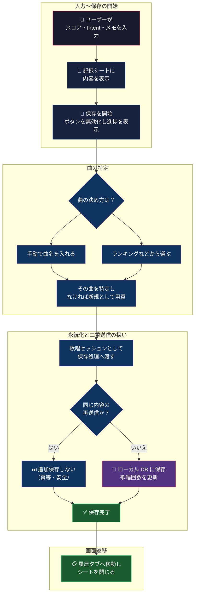
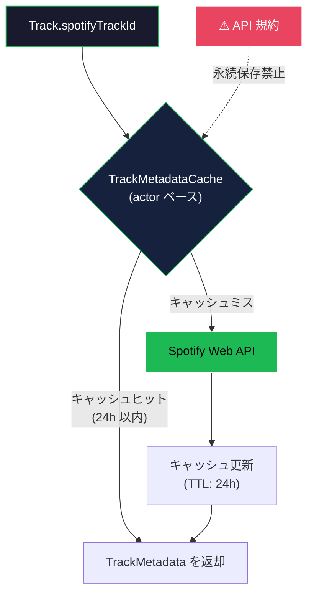
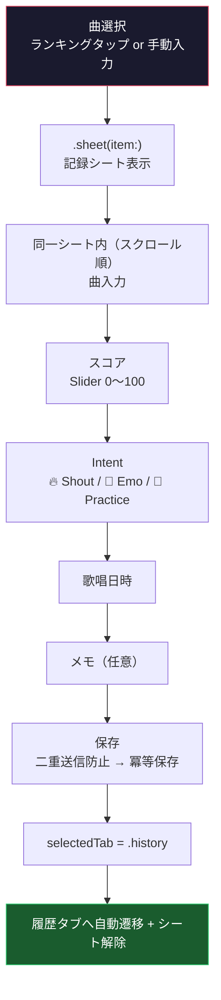
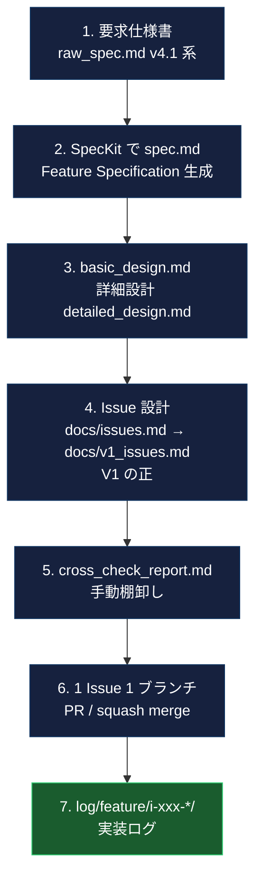

# Hitokara Log — ヒトカラモバイルiOS

> **「一人カラオケの相棒」** — 曲選びから歌唱、振り返りまでを一つの体験として支援し、一人カラオケを "積み重なる体験" に変えるアプリです。

<p align="center">
  
  
  
  
  
</p>

<p align="center">
  <b>選曲ホーム</b> → <b>歌唱記録</b> → <b>履歴</b> → <b>タイムマシン</b> → <b>マイアンセム</b>
</p>

### 要約（約 30 秒）

- **何のアプリか**: 一人カラオケ向け iOS アプリ。歌唱の文脈（Intent・スコア・メモ）を SwiftData に蓄え、タイムマシン／マイアンセムで「次に歌う曲」の意思決定を支援する。
- **プロダクトの核**: Intent（🔥 Shout / 🌙 Emo / 🎤 Practice）で「なぜその曲を歌ったか」をラベル化。オフラインファーストでローカル DB を SSOT とする。
- **スコープ**: 手動曲名入力を含め、ローカル完結で「記録 → 振り返り」のコア体験が完結する。
- **技術**: SwiftUI / SwiftData（iOS 17+）、MVVM + Repository、Spec 駆動開発と `.cursorrules` による実装規約。

**この README の二層の読み方**

| 層 | 読む場所 |
|----|----------|
| **短く** | 上の要約 → 後述の「クイックスタート」までで全体像 |
| **詳しく** | その下の各見出しは、プロダクト説明 → アーキテクチャ・データフロー → 開発プロセス・テストの順で深掘り |

---

## 📝 概要

Hitokara Log は、「何を歌おう…」という迷いを減らし、自分の歌唱体験を記録・振り返るための iOS アプリです。過去の歌唱記録をもとに次に歌う曲の意思決定を支援し、単発で終わりがちな一人カラオケを **蓄積される体験へと変換する** ことを目的としています。

---

## 🔥 Problem

一人カラオケは感情価値の高い体験である一方で、体験の文脈（**選曲理由・感情・手応え**）が記録されないため、**毎回リセットされる構造**になっている。

Spotify や Apple Music は「聴いた曲」を記録するが、「歌った曲」「どんな気持ちで歌ったか」「手応えのスコア」は記録されない。カラオケ採点アプリは点数だけで文脈が残らない。このギャップを埋めるのが Hitokara Log の立ち位置。

| 課題 | 技術的なアプローチ |
|------|------------------|
| 体験の文脈が消える | **Intent（🔥 Shout / 🌙 Emo / 🎤 Practice）** で感情をラベリングし、スコア・メモとともに SwiftData に永続化 |
| カラオケボックスの通信環境が不安定 | **オフラインファースト設計** — ローカル DB（SwiftData）を SSOT とし、API 不通でも体験が劣化しない |
| 歌唱記録が散逸する | **タイムマシン**（過去 1 ヶ月ランキング）・**マイアンセム**（Intent 別回数/点数ランキング）でローカル集計し、次の選曲を支援 |

---

## 🎯 ユーザー価値

（プロダクトの課題設定は「Problem」節、Intent の定義は「Intent（歌唱の意図）」節と対になる説明です。）

- **曲選びの迷いが減る** — タイムマシン・マイアンセムが「前に歌ってよかった曲」を提示
- **歌唱体験を記録できる** — Intent + スコア + メモで、歌った文脈を残す
- **自分の傾向を振り返れる** — Intent 別ランキングで「最近 Shout 多いな」「Emo の点数が伸びた」が見える
- **一人カラオケが蓄積される体験になる** — 毎回の記録が次回の選曲トリガーになるサイクル

---

## 🎙 Intent（歌唱の意図）— プロダクト設計の核

一人カラオケで「歌う理由」は毎回異なる。ストレス発散で叫びたい日もあれば、しんみりバラードに浸りたい日もある。しかし既存のカラオケアプリは「曲名 + 点数」しか残さないため、**なぜその曲を選んだかという文脈が消える**。

Hitokara Log では、この「歌唱の意図」を **Intent** という 3 つのモードで表現する:

| Intent | 意味 | ユーザーの感情 | 選曲傾向 |
|--------|------|---------------|----------|
| 🔥 **Shout** | 叫ぶ・発散する | ストレス発散、テンションを上げたい | アップテンポ、ロック、アニソン |
| 🌙 **Emo** | 感情に浸る | しんみりしたい、感動したい | バラード、しっとり系、思い出の曲 |
| 🎤 **Practice** | 練習する | 上手くなりたい、高得点を狙いたい | 苦手な曲、新曲、音域チャレンジ |

### なぜ 3 つに絞ったか

V1 時点では、一人カラオケの動機はおおむね「発散」「感情」「上達」の 3 軸に**集約できるのではないか**と推測し、この前提で Intent を 3 つに絞って実装している（本番運用後のユーザー検証は別途）。選択肢が多すぎると記録時の認知負荷が上がり、少なすぎると文脈が残らない、という一般論に合わせ、**3 択なら 1 秒で選べて、かつ振り返り時に意味のある軸になる**バランスを狙った。

### プロダクト価値との接続

Intent は単なるラベルではなく、**振り返り機能の基盤**として設計している:

- **マイアンセム**: Intent 別に「歌った回数ランキング」「平均スコアランキング」を集計。「Shout で最も歌った曲」「Emo でスコアが高い曲」が一目でわかる
- **選曲トリガー**: 「今日は Shout の気分」→ マイアンセムの Shout ランキングから曲を選ぶ、という次回の選曲フローが生まれる
- **傾向の可視化**: 「最近 Practice ばかりだな」「Emo の点数が伸びた」といった自己発見を促す

### 技術実装

```swift
/// 歌唱の意図（ドメインでは enum、永続化時は RawValue で扱う）
enum Intent: String, Codable, CaseIterable, Sendable {
    case shout
    case emo
    case practice
}
```

`Intent` は `String` RawValue の enum として定義し、SwiftData の永続化時は自動的に RawValue（文字列）で保存される。`CaseIterable` でフィルター UI の選択肢を自動生成し、`Sendable` で Swift Concurrency の安全性を保証している。Intent 別の集計は `InsightRepository` が SwiftData からセッション一覧を取得し、メモリ上で Intent ごとにグルーピング・ソートする設計（DB 側の Predicate による enum 絞り込みは SwiftData の制約で不安定なため回避 — 詳細は「技術的な壁」セクション参照）。

---

## 💡 技術的な工夫（Highlights）

保存フロー・冪等性の全体像は「データフロー」節の「歌唱記録の保存フロー」を参照。以下は代表的な実装判断のハイライトである。

### 1. Spotify API 規約と設計の両立

Spotify API 規約でメタデータ（曲名・アーティスト名・アートワーク）の永続保存が禁止されている。この制約に対し、**Track エンティティに `spotifyTrackId` のみを保持し、表示用メタデータは V2 で actor ベースのインメモリ TTL キャッシュ（24h）から取得する設計**を先行して定義した。

V1 では `userEnteredName`（ユーザー生成データ＝永続化可）で曲名表示を行い、Spotify 未連携でもコア体験を完結させた。Track の convenience init を `spotifyTrackId` 用（`precondition(!spotifyTrackId.isEmpty)`）と `userEnteredName` 用に分離し、private init で代入ロジックを単一化することで、将来の Spotify 連携時に Track の型安全性を壊さず拡張できるようにした。

### 2. `loadGeneration` カウンタによる非同期競合排除

`HistoryViewModel` では、フィルター変更や削除処理が非同期完了と交差したとき、古いレスポンスが `sessions` を上書きする問題がある。`Task.cancel()` は cancel が非同期で伝播するため「cancel 前に完了した古い fetch が先に sessions を書き換える」ケースを完全には防げない。

そこで `loadGeneration` カウンタを導入し、**発行世代と完了世代が一致する場合のみ `sessions` を書き換える**パターンを採用した。コストは Int の加算と比較のみ（O(1)）で、`loadInitial` / `loadNextPageIfNeeded` / `deleteSession` のすべてで統一的に競合を排除できる。

### 3. 歌唱記録の 1 シート統合と NavigationStack 設計

仕様上は Intent 選択画面・歌唱記録入力画面が別画面（S-004/S-005）だったが、**UX 改善のため 1 枚の Recording Sheet に統合**し、**曲名入力 → スコア → Intent → 歌唱日時 → メモ → 保存**を途切れなく完結できるようにした。

`NavigationStack` の push で歌唱記録を出すと、保存後に `NavigationPath` を空にして pop する際にルートビュー（インテント一覧）が一瞬露出する「チラつき」が発生する。`.sheet(item:)` によるモーダル表示に切り替えることで、保存後は `presentedRecordingRoute = nil`（シート解除）+ `selectedTab = .history` のみで遷移が完結する。

### 4. History の値型スナップショットパターン

`HistoryViewModel` は SwiftData インスタンスを直接保持せず、`HistorySessionRowDisplayItem`（値型）にマッピングして保持。これにより:

- **楽観的 UI 更新**: 削除時に先にスナップショットから除外し、DB 削除失敗時はスナップショットを復元。ユーザーには即座に反映される
- **メモリ制御**: 歌唱回数が多いユーザーで 2000〜3000 件に達する想定に対し、一覧保持の上限を 500 件に設定。値型のため SwiftData の fault を踏まない
- **ソート・フィルター**: 値型配列に対するメモリ上の操作で完結し、再フェッチが不要

### 5. 冪等性の二重保証

カラオケボックス（地下）の不安定な通信環境を前提に、二重送信を 2 段階で防止:

- **UI 層**: 保存ボタン即時非活性化（`isSaving` フラグ）+ ProgressView + ユーザーインタラクションブロック
- **データ層**: クライアント生成 UUID を Idempotency Key として `exists(uuid)` チェック → 既存なら insert / `singCount` 加算をスキップして成功扱い

UI 層のみの制御は「ボタン tap → 非活性化」の間にタッチイベントが2回発火するエッジケースに対応できないため、データ層の冪等保証が必須。

### 6. テストにおける DI の活用

ユニットテスト（14 ファイル）では Repository Protocol の DI が実際に機能している:

- `SwiftDataSessionRepository*Tests`（4 ファイル）: in-memory `ModelContainer` で SwiftData の実インスタンスを生成し、冪等性・削除・更新・Intent フィルターをテスト
- `HistoryViewModel*Tests`（3 ファイル）: Mock Repository を ViewModel init に注入し、ページネーション・ソート・loadGeneration の競合を検証
- `RecordingSheetViewModelEditSaveTests`: 新規作成と編集の分岐を Protocol 差し替えで検証

---

## 🧠 技術的な壁と解決策

### 1. SwiftData `#Predicate` × enum の不安定性

`#Predicate<SingingSession> { $0.intent == .shout }` はコンパイルが通るが、iOS 17.0〜17.2 の実機で `NSPredicateError` に類する実行時エラーが発生するケースを確認した。RawValue（String）比較への書き換えも試みたが、`#Predicate` の型推論と衝突して安定しなかった。

**解決策**: `fetchByIntent` を直近 `SessionRecentWindow.maxSessionCount` 件の `fetchAll` 後にメモリ上で `filter { $0.intent == intent }` する方式に切り替え。`intentFilterCache` で同一 Intent のページ追加時に再フェッチを抑制した。この判断はコード内コメントに理由を記載している。

### 2. NavigationStack と .sheet の共存バグ

選曲タブで `NavigationStack` の `navigationDestination` と `.sheet` を同時に使うと、sheet dismiss 後に `NavigationStack` の状態が壊れ、push 遷移が効かなくなるケースが iOS 17.0 で発生した。原因は `NavigationPath` と sheet の `isPresented` が同一 View 更新サイクルで競合するため。

**解決策**: 選曲タブは **NavigationStack（ルートのみ・push なし）+ `.sheet(item:)` のみ**に統一。歌唱記録は push せずシートで表示し、保存後は `presentedRecordingRoute = nil` + `selectedTab = .history` で遷移する。この設計判断は `docs/v1_navigation_songs_recording.md` に経緯を記録した。

### 3. 仕様書群の矛盾管理

5 ファイル以上の仕様書（raw_spec → spec.md → basic_design → detailed_design → issues）間で、Spotify メタデータのキャッシュ戦略について「UserDefaults」と「インメモリ 24h キャッシュ」で矛盾が発生した。`cross_check_report.md` で矛盾を手動棚卸しし、全ドキュメントを「インメモリ一時キャッシュ・永続化禁止」に揃えた。`v1_issues.md` を V1 の Single Source of Truth とする運用で再発を防止。

---

## 🏗 アーキテクチャ

### 採用設計:　MVVM + Repository パターン

| レイヤー | 責務 | SwiftUI 依存 |
|----------|------|--------------|
| **Presentation** | View（描画専用）+ ViewModel（`@Observable`・`@MainActor`） | ✅ |
| **Domain** | Protocol 定義・Model 定義・ヘルパー。外部 FW 非依存が原則 | ❌（※ @Model のみ例外許容） |
| **Data** | SwiftData / Network の具体実装 | ❌ |
| **App** | `@main` エントリ、DI 組み立て、EnvironmentKey 定義 | ✅ |

### 技術選定の理由

| 技術 | 選定理由 |
|------|----------|
| **SwiftData** | iOS 17+ ネイティブ ORM。Track 1:N SingingSession の単純なリレーションに対してサードパーティ ORM は過剰。`@Model` の変更が View に自動伝播する点を評価 |
| **`@Observable`（iOS 17+）** | `@StateObject` / `@ObservedObject` を不要にし、`objectWillChange` の手動管理をゼロに。ViewModel を plain class として扱える |
| **Repository パターン** | SSOT をローカル DB に限定し、オフラインファーストを実現。Protocol 分離でテスト時に in-memory / mock に差し替え |
| **手動 DI（`@Environment`）** | Swinject 等の DI コンテナを使わず、EnvironmentKey でプロトコル型を注入。依存グラフが浅い V1 では過剰な抽象化を避けた |

---

## 🔄 データフロー

### 歌唱記録の保存フロー（V1 実装）

V1 ではオンライン・オフライン問わず同一フロー（Spotify API 呼び出しなし）。View → ViewModel → Repository → SwiftData の各層が明確に分離されている:



### オフライン時の挙動


### Spotify メタデータ取得（V2 設計済み・未実装）



---

## 🧩 技術的な設計

### 状態管理

| 仕組み | 用途 |
|--------|------|
| `@Observable` + `@MainActor` | ViewModel の状態保持。1 画面 1 ViewModel |
| `@State` | View 内の一時 UI 状態、ViewModel インスタンスの保持 |
| `@Binding` | 親→子の双方向バインディング |
| `@Environment` | Repository・NetworkMonitor 等のアプリ全体共有 |

### 非同期処理

- **`async throws`** を基本とする構造化並行性（Swift Concurrency）
- Repository・ViewModel とも `@MainActor` で ModelContext のスレッド安全性を保証
- `Task.checkCancellation()` によるキャンセル伝播 + `loadGeneration` による世代管理（前述）

### データ管理

| 区分 | 永続化・ストレージ | 対象 |
|------|-------------------|------|
| **V1 で実装済み** | **SwiftData（SSOT）** | Track（`spotifyTrackId`, `userEnteredName`, `singCount`, `latestScore`）、SingingSession（`intent`, `score`, `memo`, `performedAt`） |
| **V1 で実装済み** | **UserDefaults**（方針上） | チュートリアル表示フラグ等の UI 設定のみ（`.cursorrules` の範囲） |
| **V2 設計・未実装** | **インメモリ TTL キャッシュ（24h）** | Spotify メタデータ（曲名・アーティスト名・アートワーク）— API 規約により永続化禁止 |
| **V2 設計・未実装** | **Keychain** | OAuth トークン（現コードベースでは Keychain 未使用） |

### オフラインファースト

- `NWPathMonitor` ベースの `NetworkMonitor`（`@Observable`）で接続状態を監視
- オフライン時: `Track(userEnteredName:)` でローカル保存。ブロックせず継続
- **V2（Spotify 連携）設計**: オンライン復帰時に `spotifyTrackId` 経由で Spotify API からメタデータを補完する想定（外部サーバー同期なし）。**V1 では OAuth / API クライアント未実装のためこの補完フローは未実装**

---

## 📱 アプリ概要（UI/UX）

### 主要画面

| 画面 | 役割 |
|------|------|
| 選曲・ホーム | V1 はインテントのみ（タイムマシン / マイアンセム）。V2 で Spotify 視聴履歴を追加予定 |
| 歌唱記録シート | **1 枚のシート**で完結。曲入力 → スコア → Intent → 歌唱日時 → メモ → 保存（`RecordingSheetContentView`） |
| History | 日時降順一覧、Intent フィルター、ソート、Infinite Scroll（20 件/ページ、末尾 5 行でプリフェッチ、500 行上限）、スワイプ削除・編集 |
| 設定 | V1 はプレースホルダー。V2 で Spotify 連携状態・クレジット等を実装予定（I-033） |

### ユーザーフロー



---

## 📂 ディレクトリ構成

<details>
<summary>Sources/ ツリー（全文・クリックで展開）</summary>

```
Sources/
├── App/                          # @main エントリポイント、EnvironmentKey（DI 配線）
│   ├── KaraokeSupportApp.swift   # ModelContainer 生成、Repository 注入
│   ├── *RepositoryEnvironment.swift  # 各 Repository の EnvironmentKey
│   ├── Preview*Repository.swift  # プレビュー用モック
│   ├── NetworkMonitorEnvironment.swift
│   └── ManualRecordingNavigationEnvironment.swift
│
├── Presentation/                 # View + ViewModel（画面単位でサブフォルダ）
│   ├── Recording/                # 歌唱記録シート（曲入力 → スコア → Intent → メモ + 保存）
│   ├── History/                  # 履歴一覧（フィルター・ソート・ページネーション・削除・編集）
│   ├── Songs/                    # 選曲ルート・インテントタブ（タイムマシン・マイアンセム、`NavigationStack` + `.sheet`）
│   ├── Insight/                  # 現状はプレースホルダー（`.gitkeep`）。将来の拡張用
│   ├── Search/                   # ハイブリッド検索（V2・現状 `.gitkeep`）
│   ├── Settings/                 # 設定画面（プレースホルダー、V2 で本実装）
│   ├── Root/                     # RootView（TabView）
│   ├── Common/                   # 共通コンポーネント（Empty State 等）
│   └── Theme/                    # AppColor（セマンティック色トークン）
│
├── Domain/                       # Protocol 定義・モデル（フレームワーク非依存が原則）
│   ├── Models/
│   │   ├── SwiftData/            # Track, SingingSession（@Model）
│   │   ├── Enums/                # Intent
│   │   ├── Flow/                 # SelectedTrack, RecordingDraft
│   │   └── Rankings/             # InsightTrackCountRanking, MyAnthemRanking 等
│   ├── Repositories/             # SessionRepositoryProtocol, TrackRepositoryProtocol, InsightRepositoryProtocol
│   └── Helpers/                  # TrackDisplayTitle
│
└── Data/                         # 具体実装（SwiftData, Network, Spotify[V2], Cache[V2]）
    ├── SwiftData/                # SwiftDataSessionRepository, SwiftDataTrackRepository, SwiftDataInsightRepository
    ├── Network/                  # NetworkMonitor（NWPathMonitor）
    ├── Spotify/                  # V2 用（現状 `.gitkeep`）
    └── Cache/                    # V2 用（現状 `.gitkeep`）
```

</details>

---

## 🧭 開発プロセス（Spec 駆動）

### V1（MVP）の定義

V1 は **「コア体験が成立するかを検証する最小構成」** として定義した。具体的には **曲選択 → 歌唱 → 記録 → 振り返り** のフローが一連で動作することを完了条件とする。

| 判断基準 | V1（今回のスコープ） | V2（次期スコープ） |
|----------|---------------------|-----------------|
| コア体験に必須か | ✅ 必須 — 手動曲入力・Intent・スコア・履歴・インサイト | ❌ 付加価値 — Spotify 連携・検索 API・オンボーディング |
| 体験が完結するか | ✅ ローカルだけで完結（オフラインでも動作） | ❌ 外部 API が前提の機能 |
| 本質か付加価値か | ✅ 記録と振り返りの本質 | ❌ 体験の質を高める拡張 |

**なぜ Spotify 連携は V2 か**: Spotify OAuth / メタデータキャッシュ / 検索 API は「体験の質を向上させる」機能であり、コア体験（記録 → 振り返り）の成立には不要。V1 では手動曲名入力のエスケープハッチにより Spotify なしでも全フローが動作する。

**用語（README 内）**: 本 README の **「製品ロードマップ上の V2」**（体験拡張・Spotify 中心）は、**`docs/issues.md` の Phase 3（Spotify 連携）〜 Phase 4（品質・運用）**に概ね対応する。Phase 0〜2 は V1（MVP）の実装範囲に相当。

**V1 の完了条件・チェックリスト**: [`docs/v1_issues.md`](docs/v1_issues.md)（末尾の V1 完了判定チェックリスト）を参照。

### Spec → Issue → 実装 の流れ

本プロジェクトでは **SpecKit** によるスペック駆動開発を採用し、以下のフローで開発を進めた。



**フロー内の補足（各ステップの詳細）**

- **2. SpecKit で Feature Specification（spec.md）を生成**
  - User Story / Acceptance Scenario / Functional Requirements を定義
- **3. 基本設計書（basic_design.md）・詳細設計書（detailed_design.md）を作成**
  - 画面遷移図・シーケンス図・クラス図・ER 図を Mermaid で記述
- **4. Issue 設計（`docs/issues.md` → `docs/v1_issues.md`（V1 の正））で実装タスクに分解**
  - Phase 0（基盤）→ Phase 1（MVP）→ Phase 2（インサイト）→ Phase 3/4（Spotify 連携・品質）
  - **番号の対応**: 全フェーズ一覧は `issues.md`、V1 スコープの分解・完了チェックは **`v1_issues.md`** を参照（同一 Issue でも文言が V1 に寄せてある場合あり）

### AI × 仕様駆動開発

`.cursorrules`（132 行）で SwiftUI/SwiftData のコーディングルール・命名規則・Git ルールを定義し、Cursor のプロジェクトルールとして読み込ませた。`.specify/memory/constitution.md` を最上位ルールとしてプロンプトに含め、AI の出力に一貫した制約を与えている。

**AI の具体的な効果**: constitution.md に「Spotify メタデータは永続化禁止」「`spotifyTrackId` のみ保持可」の制約を明記した結果、AI が Track モデルを生成する際に `userEnteredName`（ユーザー生成データ＝永続化可）と Spotify 由来データの区別を自発的に判別し、convenience init の分離やコメントでの理由記載まで一貫して行った。人間のレビューは「制約に違反していないか」の確認に集中でき、生成コードの修正量が大幅に削減された。

---

## 🔗 Spec / Issue / 実装の対応関係

Phase 0〜2（V1 スコープ）は全 Issue 実装済み。代表的なものを抜粋:

| Issue | 概要 | 実装の要点 | テスト |
|-------|------|-----------|--------|
| I-002 | SwiftData モデル定義 | `Track`（メタデータ非永続化・dual init）、`SingingSession`（UUID idempotency key） | — |
| I-003 | SessionRepository | 保存（冪等）・更新（Track 差し替え禁止）・削除（singCount 減算）・fetchByIntent | 4 ファイル |
| I-009/011 | 歌唱記録 + 冪等性 | RecordingSheetViewModel + exists(uuid) チェック | `I011SessionIdempotencyTests` |
| I-014/015 | History + Infinite Scroll | 値型スナップショット・loadGeneration・20 件ページング | 3 ファイル |
| I-017/018 | インテントタブ + タイムマシン | IntentTabViewModel・月次ランキング集計 | `IntentTabViewModelTests` |

全対応は `docs/v1_issues.md` を参照。

---

## ✅ 実装済み機能（V1 — Phase 0〜2 完了）

プロダクト価値・Intent の定義は「ユーザー価値」および「Intent（歌唱の意図）」の各節を参照。以下は **実装済み機能の列挙**（チェックリスト）である。

<details>
<summary>V1 実装チェックリスト（全文・クリックで展開）</summary>

- [x] SwiftData モデル定義（Track 1:N SingingSession、Intent enum）
- [x] SessionRepository（保存・更新・削除・検索・冪等性チェック）
- [x] TrackRepository（ローカル検索・getOrCreate・歌唱回数更新）
- [x] InsightRepository（タイムマシン・マイアンセムランキング取得）
- [x] ネットワーク監視ユーティリティ（NWPathMonitor）
- [x] タブナビゲーション基盤（TabView + 各タブ独立 NavigationStack）
- [x] DI 接続（@Environment + カスタム EnvironmentKey）
- [x] 歌唱記録シート（曲入力 → スコア → Intent → 歌唱日時 → メモ + 保存、1 枚のシートで完結）
- [x] 手動曲名入力（オフライン時の接続案内を含む）
- [x] 二重送信防止（UI 層: ボタン非活性化 + ProgressView / データ層: UUID 冪等性）
- [x] 歌唱記録フロー統合（曲選択 → 同一シートで入力完了 → 保存 → 履歴タブへ遷移）
- [x] History 画面（日時降順一覧、Intent フィルター、スコア/日時ソート、スワイプ削除、履歴からの編集）
- [x] Infinite Scroll（20 件ごとのページネーション、末尾 5 行でプリフェッチ、500 行上限）
- [x] Empty State（歌唱 0 件時の「まず 1 曲歌ってみよう！」+ 手動記録への導線）
- [x] インテントタブ UI（タイムマシンカード + マイアンセムカード + ランキングシート）
- [x] タイムマシン表示（過去 1 ヶ月の歌唱曲ランキング、ランキングからの歌唱記録シート連携）
- [x] 色・テーマ統一（AppColor セマンティック色トークン、AccentColor 統一）
- [x] マイアンセム表示部の UI 基盤（過去 3 ヶ月の Intent 別回数/点数ランキング）

</details>

---

## 🚧 未実装 / 今後の実装

> **V2 の定義**: V1（MVP）でコア体験の成立を検証した上で、**体験の質向上・外部連携機能**を追加するフェーズ。Spotify 連携を中心に、検索・オンボーディング・アクセシビリティなどの付加価値機能で構成する。

> ⚠️ **Spotify 連携は現時点で全面未実装**。設計（`detailed_design.md` §5, `docs/issues.md` Phase 3）は完了しており、`Data/Spotify/` および `Data/Cache/` ディレクトリは `.gitkeep` で予約済み。

### Phase 2 残り

- [ ] I-020〜I-022: ハイブリッド検索画面（ローカル + Spotify API 検索、Debounce 0.5 秒、手動追加導線）

> **マイアンセム（Issue 番号の整理）**: 全体版 `docs/issues.md` の **I-019（マイアンセム表示）** に相当する UI は、**V1 では `docs/v1_issues.md` の [I-017]** に統合して実装済み（`MyAnthemRankingSheetView` 等）。

### Phase 3: Spotify 連携（V2 — 体験の質向上）

- [ ] I-023: OAuth 2.0 PKCE 認証
- [ ] I-024: トークンリフレッシュ
- [ ] I-024A: TrackMetadataService / TrackMetadataCache（actor ベースの 24h インメモリキャッシュ）
- [ ] I-025〜I-028: 最近再生した曲 API / 視聴履歴タブ / Spotify 検索 / オフラインフォールバック
- [ ] I-029〜I-031: 指数バックオフ・リトライ / API エラー再試行 UI / オンボーディング

### Phase 4: 機能拡張・品質（V2 — 運用・品質基盤）

- [ ] I-033: 設定画面の**本実装**（Spotify クレジット、プライバシーポリシーリンク等）。V1 では `SettingsRootView` がプレースホルダーのみ
- [ ] I-034〜I-035: JSON 構造化ログ / PII マスキング（SHA-256）
- [ ] I-036〜I-037: アクセシビリティの**網羅対応**（VoiceOver / Dynamic Type）。一部画面では既に VoiceOver 向けラベルを付与済み
- [ ] I-038〜I-039: Repository 単体テスト拡充 / UI テスト（E2E）

---

## ⚠️ 仕様との差分

実装コード・仕様書（`raw_spec.md` v4.1 / `spec.md` / `basic_design.md` / `detailed_design.md`）・`.cursorrules` を照合した結果、**全体仕様と V1 実装の差分**のうち主要なものを以下にまとめる。**V1 のスコープと完了条件は `docs/v1_issues.md` を優先**する。

| 項目 | 仕様上の定義 | 実装状況 | 備考 |
|------|-------------|----------|------|
| 選曲トップ UI（セグメント） | `raw_spec.md`: セグメントで Intent / Spotify を切替 | **V1** は **Intent のみ**（セグメントなし） | `SongsRootView`・`v1_issues` I-007 に合わせて簡素化。Spotify タブは V2 |
| Spotify OAuth 認証（FR-009） | Must — spec.md FR-009, basic_design §6.1 | ❌ 未実装 | Phase 3 |
| TrackMetadataCache（24h TTL） | detailed_design §3.3, constitution §I | ❌ 未実装 | Phase 3 I-024A。設計完了 |
| Spotify 検索 API（Debounce 0.5s） | raw_spec §2.2, spec.md FR-005 | ❌ 未実装 | Phase 3 I-027 |
| ハイブリッド検索画面 | basic_design §1.2 UC-004 | ❌ 未実装 | Phase 2 残り |
| Spotify クレジット / プライバシーポリシー | spec.md FR-018, FR-019 | ❌ 未実装 | Phase 4 I-033 |
| `fetchByIntent` の実装方式 | detailed_design: DB 側 Predicate | ⚠️ 差分あり | SwiftData `#Predicate` が Intent enum で不安定なため fetchAll + メモリ filter で代替（前述） |
| 指数バックオフ / JSON ログ | detailed_design §5.5, raw_spec §7.3 | ❌ 未実装 | Phase 3/4 |

> **注**: 上記の多くは **Phase 3/4** のスコープであり、V1 では意図的に対象外としたもの。**V1 の「正」は `docs/v1_issues.md`** とし、意図的な差分は本表および `v1_navigation_songs_recording.md` 等に集約する。

---

## ⚙️ 技術スタック

| カテゴリ | 技術 |
|----------|------|
| 言語 | Swift 5.9+ |
| UI フレームワーク | SwiftUI |
| ローカル DB | SwiftData（iOS 17+） |
| 状態管理 | `@Observable`（Observation framework） |
| 非同期処理 | Swift Concurrency（async/await） |
| ネットワーク監視 | NWPathMonitor（Network framework） |
| 認証 | OAuth 2.0 PKCE（**V2 設計**: Keychain にトークン保存。V1 は未実装） |
| キャッシュ | actor ベースインメモリ TTL キャッシュ（**V2 設計**。V1 は未実装） |
| テスト | XCTest（14 ユニットテスト + 1 UI テスト） |
| 最低対応 OS | iOS 17.0 |
| 対応言語 | 日本語のみ |
| 対象デバイス | iPhone のみ |

---

## 開発環境・ツール

| 区分 | 使用ツール |
|------|------------|
| OS / 実行 | macOS、**Xcode**（ビルド・シミュレータ・実機・デバッグ） |
| エディタ | **Cursor**（ソースの主編集）。コードの**生成・修正・リファクタリングは原則すべて Cursor**で実施。**GitHub Copilot によるエディタ上のコード補完・インライン生成は使用していない** |
| **Xcode** | プロジェクト管理、シミュレータ／実機の実行、デバッグ、Instruments 等 |
| 仕様駆動 | **SpecKit** による `raw_spec` → `spec.md` → 設計書 → Issue 分解（詳細は「開発プロセス（Spec 駆動）」節）。上記の実装作業は **Cursor** 上で行い、`.cursorrules` と `.specify/memory/constitution.md` をプロジェクトルールとして利用 |
| 仕様・タスク管理 | `docs/` の仕様書、`docs/v1_issues.md`、Git の Issue 連動 **feature ブランチ** |
| AI 支援（Pull Request） | **GitHub Copilot Pro**（**GitHub の学生向け特典（学割）**で利用）。**GitHub 上の Pull Request** に対するコードレビューのみに使用。**PR の説明（本文）を文脈として**指摘を受け、修正に反映してからマージ |

---

## 🚀 クイックスタート

### 前提条件

- Xcode 15.0 以上 / macOS Sonoma 以上
- iOS 17.0 以上のシミュレータまたは実機

### セットアップ & 実行

```bash
git clone https://github.com/omomi-moti/Karaoke_support.git
cd Karaoke_support
open Karaoke_support/Karaoke_support.xcodeproj
# Cmd + R でビルド & 実行（iPhone シミュレータ iOS 17+）
```

> V1 は Spotify 連携未実装のため、Spotify Developer Dashboard の設定は不要。手動曲名入力で全機能を利用可能。

起動後: 選曲タブ → ツールバー「記録を追加」→ 手動曲名入力 → スコア → Intent 選択 → 保存

---

## 🧪 テスト

### ユニットテスト（14 ファイル）

```bash
Cmd + U  # Xcode から実行
```

| テストファイル | テスト対象 |
|---------------|-----------|
| `I011SessionIdempotencyTests` | データ層の冪等性（同一 UUID による二重登録防止） |
| `SwiftDataSessionRepository*Tests`（4 ファイル） | 削除（singCount 減算）・更新（Track 差し替え禁止）・Intent フィルター・単一セッション取得 |
| `HistoryViewModel*Tests`（3 ファイル） | ページネーション（20 件単位・プリフェッチ）・ソート（日時順・スコア順）・loadGeneration 競合 |
| `IntentTabViewModelTests` | インサイト取得（成功・0 件・エラー・並行制御・月次統計） |
| `InsightTrackRowTitleTests` | ランキング行の曲名表示（優先順位・フォールバック） |
| `RecordingSheetViewModelEditSaveTests` | 編集モード保存（新規 vs 既存の分岐） |
| `SingingEmptyStateCopyTests` | Empty State の文言 |
| `TrackDisplayTitleTests` | 曲名表示ヘルパー（userEnteredName 優先） |

### UI テスト / 手動 QA

- `Karaoke_supportUITestsLaunchTests`: アプリ起動テスト（in-memory ModelContainer）
- `docs/manual_qa_I008_I009_record_save.md`: 歌唱記録保存フローの手動テスト手順

---

## 📌 今後の改善

### MVP 補足

V1 では**最小体験の成立検証**を目的とし、全機能ではなく**コアフロー（記録 → 振り返り）に集中**した。Spotify 連携は V2 として扱い、V1 はローカル完結で動作する設計となっている。以下は V2 以降で段階的に取り組む改善項目である。

### 改善ロードマップ

1. **Spotify 連携の実装（V2 / Phase 3）**: OAuth 認証 → メタデータキャッシュ → 検索 API → 視聴履歴。コア体験成立後に「体験の質」を向上させる
2. **アクセシビリティ強化（V2 / Phase 4）**: VoiceOver / Dynamic Type 対応
3. **JSON 構造化ログ（V2 / Phase 4）**: Latency / Error Rate の運用監視
4. **パフォーマンス最適化**: `fetchByIntent` の DB 側 Predicate 対応（SwiftData の安定後）、月次統計の打ち切り最適化
5. **データエクスポート**: JSON / CSV エクスポート機能
6. **iCloud 同期**: 将来的な複数デバイス対応

---

## 👤 Author

- **GitHub**: [@omomi-moti](https://github.com/omomi-moti)
