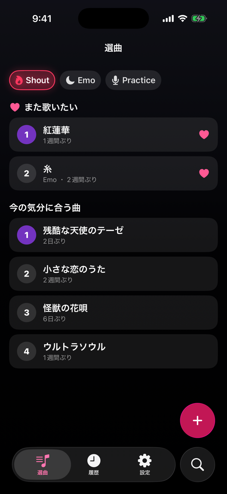
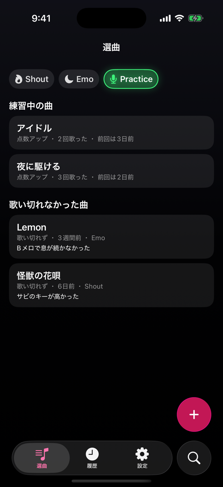
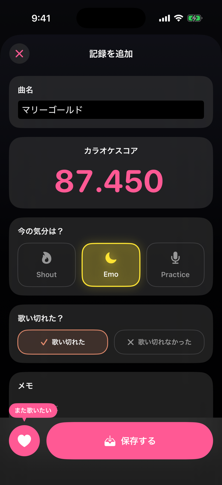
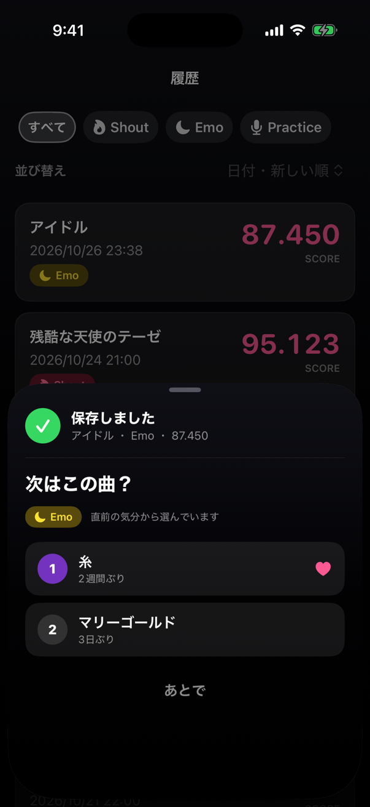
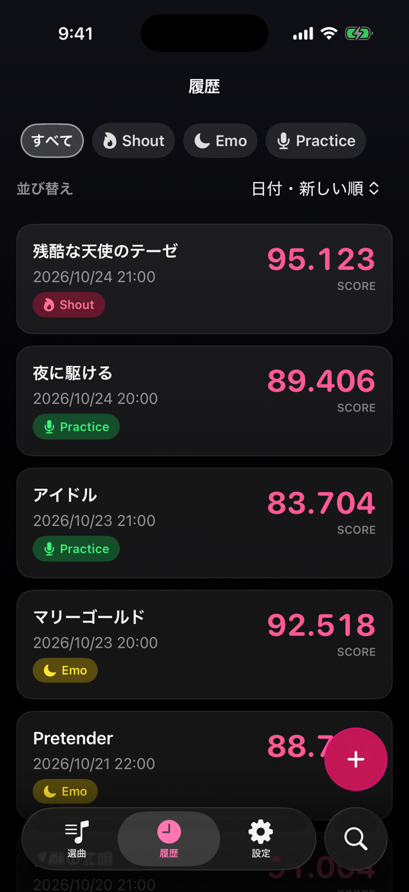
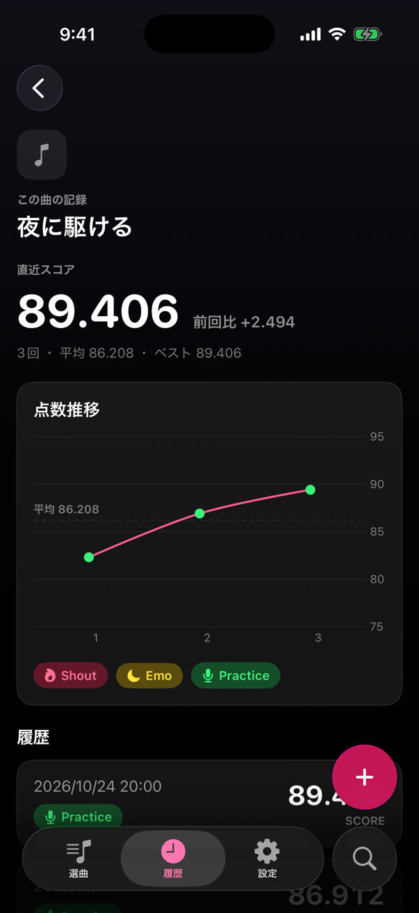
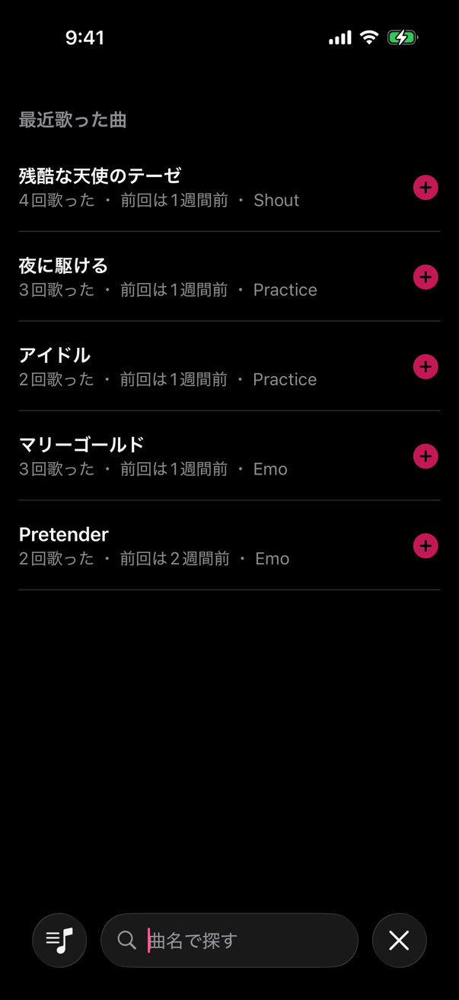

# からログ（Karalog）

> 一人カラオケの歌唱体験を記録・振り返り、次の選曲を支援する iOS アプリ。

## なぜ作ったか

一人カラオケは「何を歌おう」と毎回迷い、歌った体験も記録されずリセットされる。既存のカラオケアプリは点数しか残さず、**なぜその曲を歌ったか（感情・文脈）が消える**。

からログは、歌唱の意図を **Intent（🔥 Shout / 🌙 Emo / 🎤 Practice）** で記録し、スコア・メモとともに蓄積することで、過去の歌唱から「次に歌う曲」を提案する。単発で終わりがちな一人カラオケを **積み重なる体験** に変えるのが目的。

- カラオケボックスの通信が不安定 → **オフラインファースト**（ローカルDB完結）
- 体験の文脈が消える → **Intent** で感情をラベル化して永続化
- 前に歌って良かった曲を忘れる → **保存直後の提案**と**選曲画面**で、自分の記録（気分・点数・ハート）から次の 1 曲を思い出せる

<p align="center">
  
  
  
  
  
  
  
</p>

---

## 技術スタック

### iOS

| カテゴリ | 技術 |
|----------|------|
| 言語 | Swift 6.2（Xcode 26 付属のコンパイラ。言語モードは 5.9、Approachable Concurrency を有効） |
| UI | SwiftUI |
| ローカル DB | SwiftData |
| 状態管理 | `@Observable`（Observation framework） |
| 非同期処理 | Swift Concurrency（async/await） |
| アーキテクチャ | MVVM + Repository、手動 DI（`@Environment`） |
| 通信・認証 | URLSession、Sign in with Apple（AuthenticationServices）、サーバーのトークンは Keychain に置く |
| テスト | Swift Testing・XCTest（ユニットテスト。UI テストは起動の確認だけ） |
| 最低対応 OS | iOS 26.0 |

外部のパッケージは使っていない。

### サーバー（開発中）

| カテゴリ | 技術 |
|----------|------|
| 言語 | Go 1.27（`net/http`） |
| DB | PostgreSQL（Neon）、pgx、マイグレーションは goose |
| 実行環境 | Cloud Run（コンテナは Docker で作る） |
| 認証 | Sign in with Apple の ID トークンを検証（golang-jwt・keyfunc）し、サーバーのトークンを発行 |

---

## サーバー（開発中）

本人がオンにしたときだけ、メモ以外の記録を自前のサーバーにバックアップできるようにしている。記録の正は端末の SwiftData のままで、サーバーにつながらなくても記録と履歴は動く。この機能は App Store に出すビルドには入れず、今は Debug のビルドだけで動く（ADR 0048・0049・0053）。

- 済み：Sign in with Apple でのサインイン・ログアウト・アカウントの削除（Apple のトークンの取り消しを含む）
- これから：記録のバックアップと別の端末への取り込み、TestFlight での外部テスターへの配布、Apple Music の曲の候補（MusicKit）

設計は [`docs/backend_design.md`](docs/backend_design.md)、手元で動かす手順とデプロイは [`server/README.md`](server/README.md)。

---

## クイックスタート

**前提**: Xcode 26.0+ / iOS 26.0+ シミュレータ

```bash
git clone https://github.com/omomi-moti/Karaoke_support.git
cd Karaoke_support
open Karaoke_support/Karaoke_support.xcodeproj
# Cmd + R でビルド & 実行（iPhone シミュレータ iOS 26+）
```

起動後: 右下の「＋」ボタン → 曲名入力 → スコア（任意）→ Intent → 歌い切れた？ → また歌いたいならハート → 保存。保存すると履歴タブに移り、同じ気分で前に歌った曲（今日まだ歌っておらず、最新の記録で歌い切れたもの）があれば「次はこの曲？」で次の 1 曲の候補が出る。ハートを付けた曲は上に出る。「もっと見る」で選曲画面に移り、気分を切り替えて候補を見られる（選曲タブと同じ画面）。Practice を選ぶと、「練習中の曲」（Practice で歌い切れた曲）と「歌い切れなかった曲」が分かれて並ぶ（今日歌った曲も消えずに下へ回り、ハート付きが上に来る。Practice で保存したときの提案は練習中の曲が先）。右下の虫眼鏡で検索タブを開くとすぐ打て、打つ前は最近歌った曲が 5 件出る。曲名で探して ＋ の行を押すと、その曲で記録シートが開く

Debug のビルドでサーバーのアカウント（開発中）を試すときは、`Karaoke_support/Config/Local.xcconfig.example` を `Local.xcconfig` という名前で写し、staging のホスト名を入れる。このファイルはコミットしない。なくても、アカウントの欄が出ないだけで、ほかは動く（ADR 0055）


---

## ディレクトリ構成

<details>
<summary>Sources/ ツリー（クリックで展開）</summary>

```
Sources/
├── App/                  # @main、起動時の組み立て（AppDependencies）、サーバーのつなぎ先、DI（EnvironmentKey）、プレビュー用モック
├── Presentation/         # View + ViewModel（画面単位でサブフォルダ）
│   ├── Recording/        # 歌唱記録シート
│   ├── AfterSave/        # 保存直後のシート（次の 1 曲の提案）
│   ├── History/          # 履歴一覧
│   ├── TrackDetail/      # 曲詳細
│   ├── Songs/            # 選曲タブ
│   ├── Selection/        # 選曲画面（また歌いたい・今の気分に合う曲）
│   ├── Search/           # 検索タブ
│   ├── Settings/         # 設定タブ（アカウントの欄）
│   ├── Root/             # TabView・シートの切り替え・DB を開けなかったときの画面
│   ├── Common/           # 共通コンポーネント
│   └── Theme/            # 色トークン
├── Domain/               # Protocol・Model（フレームワーク非依存）
│   ├── Models/           # Track, SingingSession, Intent, RecordSource 等
│   ├── Repositories/     # Session / Track / Insight / TrackStats / Account の Repository
│   └── Helpers/          # 次の 1 曲の計算、曲名の候補の並べ方 等
└── Data/                 # 具体実装
    ├── SwiftData/        # Repository実装
    ├── Account/          # アカウントの Repository 実装（サーバーとのやりとり）
    ├── Keychain/         # サーバーのトークンの保存
    └── Network/          # APIClient、NetworkMonitor
```

</details>

<details>
<summary>server/ ツリー（クリックで展開）</summary>

```
server/
├── cmd/api/              # main（起動と配線）
├── internal/
│   ├── httpapi/          # ルーティング・認証・エラーの返し方・/health
│   ├── account/          # アカウント（handler / service / store）とサーバーのトークン
│   └── appleauth/        # Apple の ID トークンの検証とトークンの取り消し
└── migrations/           # goose のマイグレーション
```

</details>

---

## テスト

```bash
# 全テスト実行
xcodebuild test \
  -project Karaoke_support/Karaoke_support.xcodeproj \
  -scheme Karaoke_support \
  -destination 'platform=iOS Simulator,name=iPhone 17'
```

| テスト対象 | 内容 |
|-----------|------|
| 起動時の組み立て（AppDependencies）・つなぎ先 | DB と Repository の作成・DB を開けなかったときの throw・サーバーのつなぎ先の読み方（スキームの環境変数を優先・空や URL でない値は使わない） |
| Repository（SwiftData） | 冪等性・削除・更新・取得（Intent 別・曲別）・曲ごとの集計（最新のハート・歌い切れたか・メモを含む）・記録の入口と、その数・ハートと歌い切れたかの保存と更新 |
| HistoryViewModel・並び順 | ページネーション・ソート・非同期競合 |
| RecordingSheetViewModel | 新規／編集の分岐・保存した記録の要約・曲と気分を入れて開く・記録の入口（提案から／選曲画面から／それ以外）・ハート（新規・編集）・歌い切れたかとメモの案内・曲名の候補（もしかして）・点数入力・歌唱日時 |
| 保存直後のシート | 次の 1 曲の候補の用意（Practice は練習中の曲を先に、足りなければ歌い切れなかった曲）・理由の文言（選曲画面の気分付き・点数アップ・歌い切れずを含む） |
| SelectionViewModel | 選曲画面の読み込み・最初の気分・気分の切り替え・Practice の練習中の曲と歌い切れなかった曲・再試行・古い結果の上書き防止 |
| SearchViewModel・検索のカード | 打つ前に出す最近歌った曲（新しい順に 5 件・失敗したら再試行・古い結果の上書き防止）・打ち終わりを待つ間は前の結果を残す・行の中身（回数と前回の日を選曲画面と同じ書き方で・最新の気分・ハート） |
| TrackDetailViewModel・統計 | 曲ごとの点数推移・直近スコアと前回比・記録の削除（失敗したら戻す） |
| アカウント（Debug のビルドだけ） | サインインと自分の情報の送受信（送る項目・Bearer・401／届かない／サーバーの失敗の分け方・401 のときだけ端末のトークンを消す）・ログアウト（サーバーに消してもらい、失敗しても届かなくても端末のトークンは消す・トークンがなければ送らない）・アカウントの削除（送る項目・成功と 401 のときだけ端末のトークンを消す・403／400／サーバーの失敗／届かないの分け方・トークンがなければ送らない）・Keychain の保存と削除・nonce のハッシュ・設定のアカウントの欄（サーバーに元の nonce を送る・nonce は 1 回で使い切る・キャンセルでは何も出さない・再試行・サインインの途中で読み込んでもサインインの結果を残す・画面を離れたときに失敗を出さない・ログアウトで元に戻す・削除では元の nonce と token と認可コードを送る・値が欠けていれば送らない・Apple の確認でキャンセルしたら何も出さない・届かないときは消えていないと出す・削除のあとに知らせを出し、サインインし直したら消す） |
| Domain ヘルパー・共通 | 次の 1 曲の計算（ハート付きを上に・挑戦中の曲を外す）・選曲画面のセクション分け・挑戦中の曲の判定と、練習中の曲と歌い切れなかった曲への分け方・曲名表示・曲名候補の並べ方・点数の右詰め入力と表示・Empty State 文言 |

サーバーのテスト（`go test`、本物の DB を使うテストを含む）の流し方は [`server/README.md`](server/README.md)。

---

## ドキュメント

| 内容 | ファイル |
|------|---------|
| docs の目次（どれが正か） | [`docs/README.md`](docs/README.md) |
| 最上位のルール（憲法） | [`docs/constitution.md`](docs/constitution.md) |
| プロダクト概要・Intent設計 | [`docs/product_overview.md`](docs/product_overview.md) |
| 技術判断の記録（ADR） | [`docs/adr/`](docs/adr/README.md) |
| アーキテクチャ・データフロー | [`docs/architecture.md`](docs/architecture.md) |
| 開発プロセス（Issue・ADR・AI 活用） | [`docs/development_process.md`](docs/development_process.md) |
| V1 Issue一覧・完了チェック（アーカイブ） | [`docs/archive/v1_issues.md`](docs/archive/v1_issues.md) |
| 画面遷移設計 | [`docs/v1_navigation_songs_recording.md`](docs/v1_navigation_songs_recording.md) |
| サーバーと MusicKit の設計 | [`docs/backend_design.md`](docs/backend_design.md) |
| サーバーの動かし方・デプロイ | [`server/README.md`](server/README.md) |

---

## Author

- **GitHub**: [@omomi-moti](https://github.com/omomi-moti)
