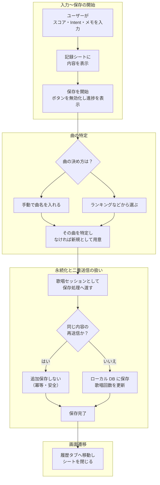
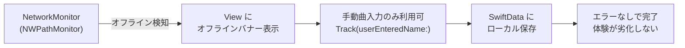
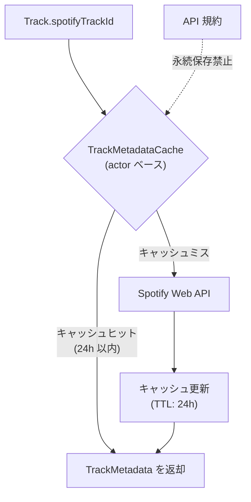
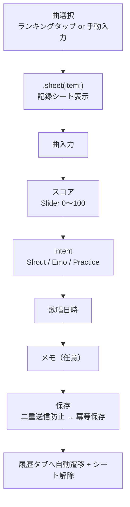

# アーキテクチャ

## 採用設計: MVVM + Repository パターン

| レイヤー | 責務 | SwiftUI 依存 |
|----------|------|--------------|
| **Presentation** | View（描画専用）+ ViewModel（`@Observable`・`@MainActor`） | Yes |
| **Domain** | Protocol 定義・Model 定義・ヘルパー。外部 FW 非依存が原則 | No（※ @Model のみ例外許容） |
| **Data** | SwiftData / Network の具体実装 | No |
| **App** | `@main` エントリ、DI 組み立て、EnvironmentKey 定義 | Yes |

---

## 技術選定の理由

### SwiftData（ローカル永続化）

Track と SingingSession の **リレーション・クエリ** が前提のため、永続化手段を次のように比較し **SwiftData** を採用した。

| 候補 | 特徴・制約 | 本プロジェクトでの判断 |
|------|------------|------------------------|
| **UserDefaults** | キー・バリュー向け。リレーション・クエリに不向き。 | 不採用 |
| **FileManager** | 生ファイル運用。整合性・検索・リレーションを自前で担保する必要あり。 | 不採用 |
| **Core Data** | 表現力は十分。スタック構成・マイグレーションの手間が大きい。 | 今回は見送り |
| **SwiftData** | `@Model` で Swift ネイティブに近い形でスキーマを定義でき、導入・変更のしやすさも両立。 | **採用** |

### `@Observable`（iOS 17+・ViewModel の状態管理）

| 観点 | `ObservableObject` + `@Published` | `@Observable` |
|------|-------------------------------------|----------------|
| 変更通知 | `@Published` や `objectWillChange` の記述が増えやすい | マクロが **プロパティ変更を観測** |
| View との接続 | `@StateObject` / `@ObservedObject` | `@State` / `@Bindable` で保持・バインドしやすい |
| ViewModel の書き方 | `ObservableObject` 準拠が前提 | **通常のクラス**として記述しやすい |

**採用理由**: ボイラープレート削減と、View 側の所有の説明の単純化を優先。

### その他（Repository・手動 DI）

| 技術 | 選定理由 |
|------|----------|
| **Repository パターン** | SSOT をローカル DB に限定し、オフラインファーストを実現。Protocol 分離でテスト時に in-memory / mock に差し替え |
| **手動 DI（`@Environment`）** | V1 は依存グラフが浅く、Swinject 等のコンテナは過剰。SwiftUI の `Environment` でプロトコル型を渡す方式で、プレビュー・テストでの差し替えもそのまま行える |

---

## データフロー

### 歌唱記録の保存フロー（V1 実装）

V1 ではオンライン・オフライン問わず同一フロー（Spotify API 呼び出しなし）。View → ViewModel → Repository → SwiftData の各層が明確に分離されている:

### オフライン時の挙動

### Spotify メタデータ取得（V2 設計済み・未実装）

---

## 技術的な設計

### 状態管理

| 仕組み | 用途 |
|--------|------|
| `@Observable` + `@MainActor` | ViewModel の状態保持。1 画面 1 ViewModel |
| `@State` | View 内の一時 UI 状態、ViewModel インスタンスの保持 |
| `@Binding` | 親→子の双方向バインディング |
| `@Environment` | Repository・NetworkMonitor 等のアプリ全体共有 |

### 非同期処理

- **`async throws`** を基本とする構造化並行性（Swift Concurrency）
- Repository・ViewModel とも `@MainActor` で ModelContext のスレッド安全性を保証
- `Task.checkCancellation()` によるキャンセル伝播 + `loadGeneration` による世代管理

### データ管理

| 区分 | 永続化・ストレージ | 対象 |
|------|-------------------|------|
| **V1 で実装済み** | **SwiftData（SSOT）** | Track（`spotifyTrackId`, `userEnteredName`, `singCount`）、SingingSession（`intent`, `score`, `memo`, `performedAt`） |
| **V2 設計・未実装** | **インメモリ TTL キャッシュ（24h）** | Spotify メタデータ（曲名・アーティスト名・アートワーク）— API 規約により永続化禁止 |
| **V2 設計・未実装** | **Keychain** | OAuth トークン |

### オフラインファースト

- `NWPathMonitor` ベースの `NetworkMonitor`（`@Observable`）で接続状態を監視
- オフライン時: `Track(userEnteredName:)` でローカル保存。ブロックせず継続
- **V2 設計**: オンライン復帰時に `spotifyTrackId` 経由で Spotify API からメタデータを補完する想定

---

## ユーザーフロー

