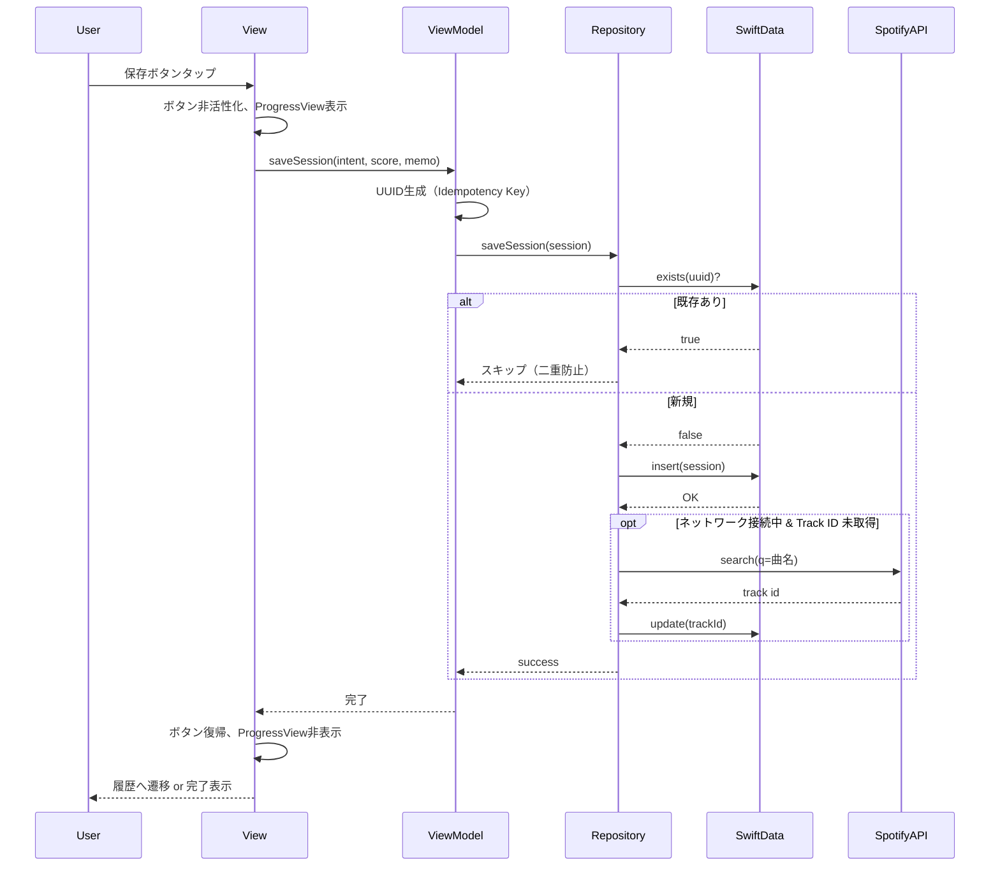
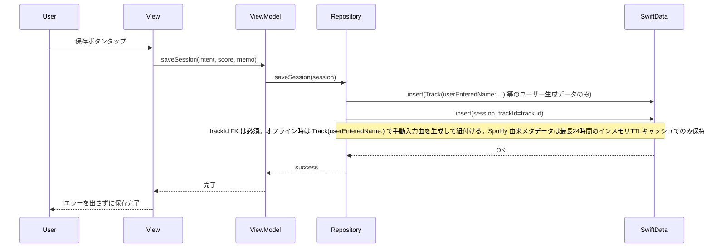
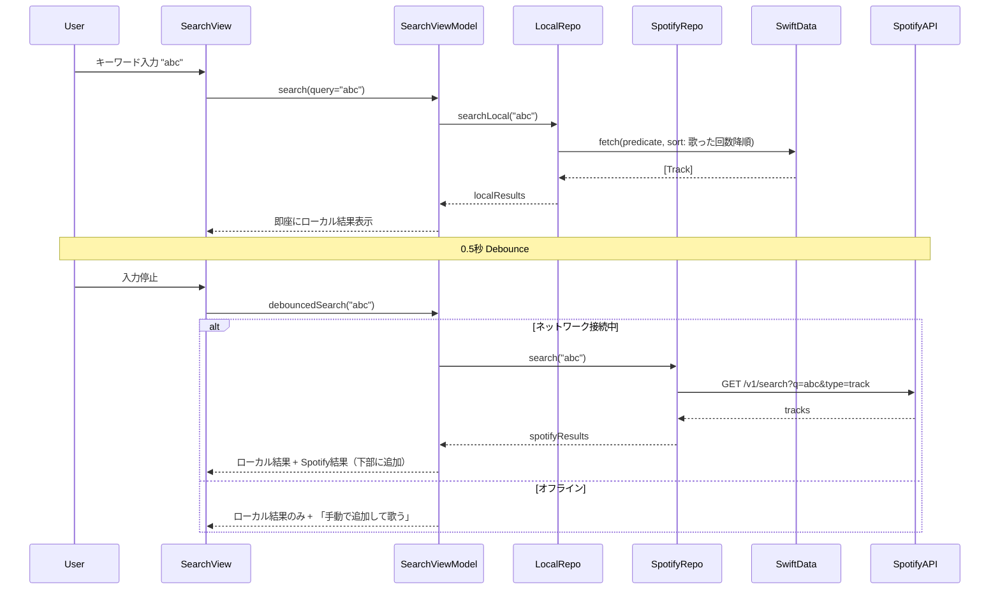
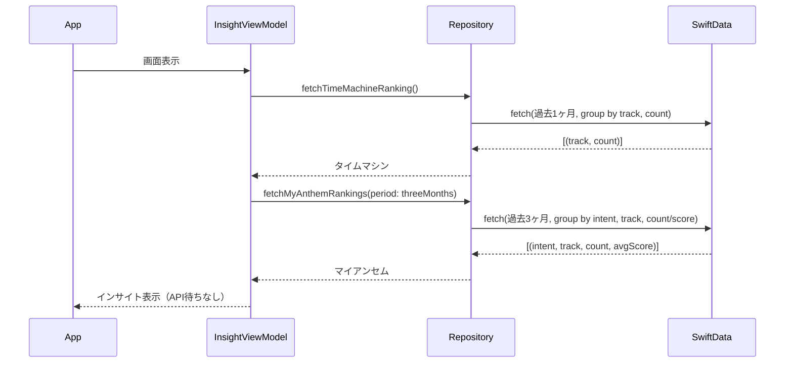
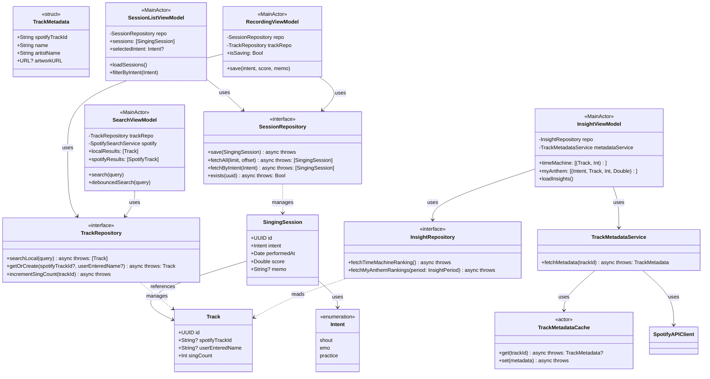
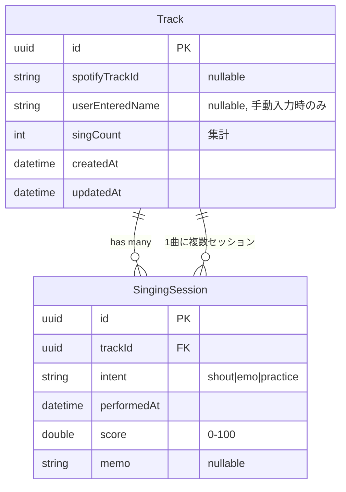
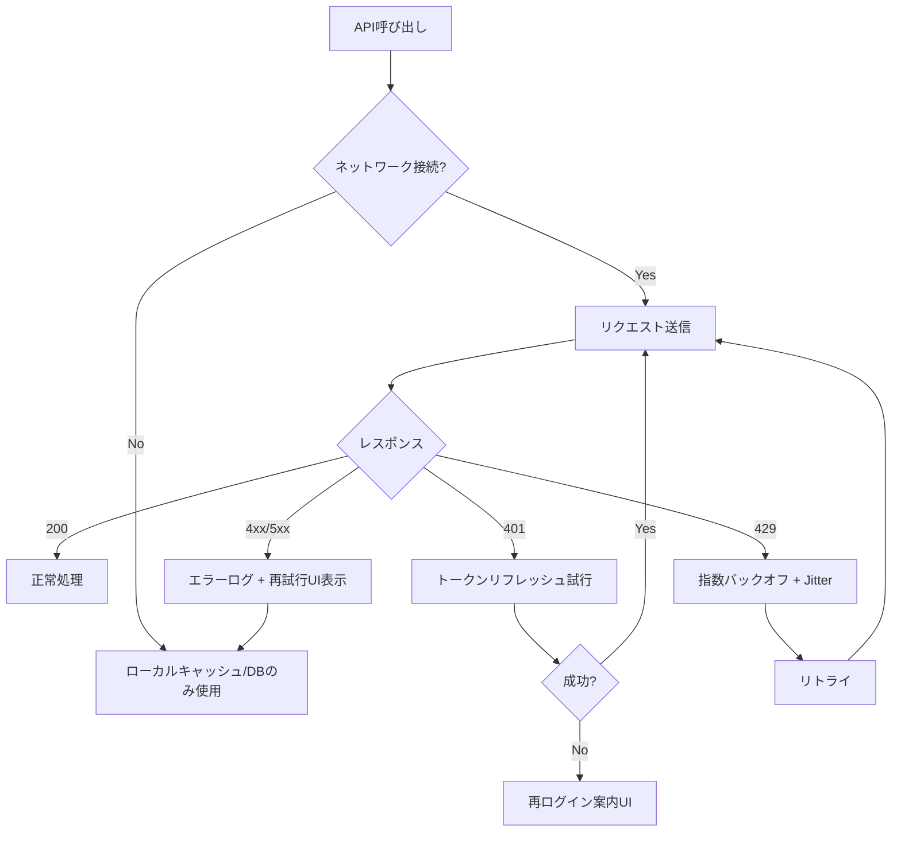

# ヒトカラモバイルiOS - 詳細設計書

**Version**: 1.2  
**Created**: 2026-03-12  
**Updated**: 2026-05-03（§2 Domainモデル設計セクション追加、セクション番号更新）  
**参照**: docs/basic_design.md, specs/001-hitora-karaoke-ios/spec.md

---

## 1. 処理フロー（シーケンス図）

### 1.1 歌唱セッション保存フロー（オンライン）



### 1.2 歌唱セッション保存フロー（オフライン）



### 1.3 ハイブリッド検索フロー



### 1.4 インサイト取得フロー（起動時）



---

## 2. Domainモデル設計

### 2.1 設計方針

Domain層のモデルは以下の原則に従って設計されている。

- **SwiftUI / SwiftData に対する依存を最小化する**。`Track` と `SingingSession` は永続化のために `@Model` を使用しているが、これは「Domain層に `@Model` を置くことでマッピング層を不要にし、実装をシンプルに保つ」ための意図的な例外（`.specify/memory/constitution.md` 参照）
- **Spotify メタデータを永続化しない**。Spotify から取得した曲名・アーティスト名・アートワーク等は SwiftData / UserDefaults 等に一切保存しない。永続化するのは識別子（`spotifyTrackId`）とユーザー生成データのみ（詳細は §4 参照）
- **ユーザーの意図（Intent）をドメイン概念として扱う**。Intent は UI 表示用ラベルではなく、インサイト集計・フィルタリングのキーとして全域で機能するドメイン概念である

### 2.2 Track

**責務**: 「どの曲を歌ったか」を識別するエンティティ。Spotify 由来の曲と手動入力曲を統一的に扱い、歌唱回数（`singCount`）の集計値を保持する。

**主なプロパティ**:

| プロパティ | 型 | 説明 |
|---|---|---|
| `id` | `UUID` | 内部主キー |
| `spotifyTrackId` | `String?` | Spotify 識別子（永続化可のキー）。Spotify 由来の曲のみ非 nil |
| `userEnteredName` | `String?` | ユーザーが入力した曲名（ユーザー生成データのため永続化可）。手動入力曲のみ非 nil |
| `singCount` | `Int` | 歌唱回数の集計値。`saveNewRecordingSession` で +1、`deleteRecordingSession` で -1 |
| `sessions` | `[SingingSession]` | 紐づく歌唱記録（逆参照。現状の集計処理では未使用） |

**設計制約**:

- `spotifyTrackId` と `userEnteredName` のどちらか一方は必ず非 nil かつ非空文字でなければならない。これを保証するために public な初期化子を 2 本用意し、両方 nil でのインスタンス化をコンパイル時に防いでいる
- Spotify から取得した曲名・アーティスト名・アートワーク等は **このモデルに保存しない**（Spotify API 規約準拠）

```
// Track の2種の初期化経路
Track(spotifyTrackId: "xxx")          // Spotify 由来の曲
Track(userEnteredName: "夜に駆ける")   // 手動入力の曲
```

### 2.3 SingingSession

**責務**: 「1回の歌唱記録」を表現するエンティティ。どの曲（Track）を、どの意図（Intent）で、いつ、何点で歌ったかを保持する。SingingSession が歌唱体験データの SSOT。

**主なプロパティ**:

| プロパティ | 型 | 説明 |
|---|---|---|
| `id` | `UUID` | Idempotency Key（二重送信防止の主キー）。UI 層で生成する |
| `track` | `Track` | 紐づく曲（必須） |
| `intent` | `Intent` | 歌唱の意図（永続化時は `RawValue: String`） |
| `performedAt` | `Date` | 歌唱日時 |
| `score` | `Double` | スコア（0〜100）。桁数・丸めは ViewModel で制御する |
| `memo` | `String?` | メモ（任意） |

**冪等性の保証**: `id` を Idempotency Key として使用し、同一 `id` のセッションが既に存在する場合は insert も `singCount` 加算も行わずに成功扱いとする。UI 層の `isSaving` フラグと合わせた二重構造で重複保存を防止する。

### 2.4 Intent

**責務**: ユーザーが歌唱時に持った「意図・モード」を表すドメイン列挙型。単なる表示ラベルではなく、インサイト集計（`fetchMyAnthemRankings`）・履歴フィルタリング（`HistoryIntentFilter`）のキーとして全域で機能するドメイン概念。

**定義されている値**:

| 値 | 意味 | 表示名 | emoji | systemImage |
|---|---|---|---|---|
| `shout` | 叫び・シャウト系 | Shout | 🔥 | `flame.fill` |
| `emo` | エモ・感情系 | Emo | 🌙 | `moon.fill` |
| `practice` | 練習・技術向上 | Practice | 🎤 | `mic.fill` |

> **表示仕様の配置方針**: `displayLabel` / `emoji` / `systemImage` などの UI 表現は Domain 層の `Intent` に直接持たせず、Presentation 層の共通ヘルパー（将来: `IntentDisplayStyle` 等）に集約する。Domain 層に SwiftUI 依存を入れないための判断。現時点では `HistoryIntentBadgeView` と `RecordingSheetIntentSection` にそれぞれ switch 文が存在する。

**準拠プロトコル**:
- `String` RawValue（SwiftData の永続化で使用）
- `Codable`（API 連携の将来対応）
- `CaseIterable`（全 Intent 一覧が必要な集計処理で使用）
- `Sendable`（Swift Concurrency 対応）

### 2.5 @Model をDomain層に置く設計判断

SwiftData の `@Model` マクロを Domain 層のファイル（`Domain/Models/SwiftData/`）に直接記述している。これは以下の理由による意図的な例外設計。

**採用理由**: `@Model` 型に対してマッピング層（DTO ↔ Domain Model の変換層）を設けると、型の二重定義・変換コストが発生し、V1 スコープでは過剰な複雑さになる。`Track` と `SingingSession` のリレーションが 1:N の単純な構造であるため、`@Model` を Domain 層に置いても依存方向（`Presentation → Domain Protocol ← Data`）は維持できる。

**制約**: Domain 層に `@Model` を置くため、`Domain/Models/SwiftData/` の型は SwiftData に依存する。SwiftUI には依存しない。将来的に純粋な Domain プロトコルへ分離する必要が生じた場合は、DTO + マッパー層の導入を検討する。

---

## 3. クラス図



- `SessionRepository.fetchAll(limit, offset)` は `performedAt` 降順で返す。
- `TrackRepository.searchLocal(query)` は `singCount` 降順で返す。

---

## 4. データベース設計

### 4.1 SwiftData スキーマ設計（Spotify API規約準拠）



**Spotify API規約準拠**: Spotify から取得した曲名・アーティスト名・アートワーク等は永続化しない。永続化するのは Track ID、ユーザーが手動入力した曲名（`userEnteredName`）、ユーザー入力データ（スコア、Intent、メモ等）、集計情報のみ。`userEnteredName` はオフライン時の手動入力曲用（ユーザー生成データのため永続化可）。

**補足**: 同一曲の2回目以降は既存 Track を取得し、新規 SingingSession のみ追加する。

### 4.2 エンティティ定義（SwiftData @Model）

```swift
// Why: Spotify API規約により、曲名・アーティスト名・アートワーク等の永続保存が禁止されているため。
// 永続化するのは Track ID と集計情報のみ。表示用メタデータは API または一時キャッシュから取得する。
@Model
final class Track {
    @Attribute(.unique) var id: UUID
    var spotifyTrackId: String?
    /// 手動入力曲用。ユーザーが入力した曲名（ユーザー生成データのため永続化可）。Spotify メタデータではない。
    var userEnteredName: String?
    var singCount: Int
    var createdAt: Date
    var updatedAt: Date

    @Relationship(deleteRule: .cascade, inverse: \SingingSession.track)
    var sessions: [SingingSession] = []
}

enum Intent: String, Codable {
    case shout
    case emo
    case practice
}

@Model
final class SingingSession {
    @Attribute(.unique) var id: UUID  // Idempotency Key
    var track: Track
    /// ドメインでは enum を使用し、永続化時は RawValue(String) で扱う。
    var intent: Intent
    var performedAt: Date
    var score: Double
    var memo: String?
}
```

**補足（Track の生成）**: Track は「どちらか必須」を型で保証するため、public の初期化子を 2 本用意している。`init(spotifyTrackId: String, userEnteredName: String? = nil, ...)`（Spotify 由来の曲用）と `init(userEnteredName: String, spotifyTrackId: String? = nil, ...)`（手動入力曲用）。`Track()` や両方 nil での生成はコンパイル不可。空文字は precondition で拒否。代入ロジックは private init に集約している。

**補足（紐付けの正本）**: Track と外部データの紐付けは `Track.spotifyTrackId` を唯一の正本キーとして扱う。`SingingSession` は `Track` への外部キー（`track` リレーション）のみを持ち、`spotifyTrackId` を冗長に保持しない。曲名・アーティスト名・アートワーク等は表示用の揮発データであり、SwiftData には保存しない。

### 4.3 メタデータの一時キャッシュ（Spotify視聴履歴・表示用）

```swift
// Why: Spotify API規約によりメタデータの永続保存が禁止。24時間以内の一時キャッシュのみ許容。
// actor ベースのインメモリキャッシュでスレッドセーフを保証。永続化しないため規約準拠。
struct CachedMetadata {
    let metadata: TrackMetadata
    let expiresAt: Date
}

actor TrackMetadataCache {
    private var cache: [String: CachedMetadata] = [:]
    private let maxAge: TimeInterval = 24 * 60 * 60  // 24時間
    private let maxCount: Int = 500  // 上限超過時は期限切れ優先で削除し、残りは古い順に削除

    func get(_ trackId: String, now: Date = Date()) -> TrackMetadata? {
        guard let entry = cache[trackId], entry.expiresAt > now else {
            cache.removeValue(forKey: trackId)
            return nil
        }
        return entry.metadata
    }

    func set(_ metadata: TrackMetadata, now: Date = Date()) {
        cache[metadata.spotifyTrackId] = CachedMetadata(
            metadata: metadata,
            expiresAt: now.addingTimeInterval(maxAge)
        )
        if cache.count > maxCount {
            evictIfNeeded(now: now)
        }
    }

    // maxCount を超えた場合は:
    // 1. 期限切れエントリをすべて削除
    // 2. それでも maxCount を超える場合は expiresAt が古い順に削除
    private func evictIfNeeded(now: Date) {
        cache = cache.filter { $0.value.expiresAt > now }
        guard cache.count > maxCount else { return }
        let overflow = cache.count - maxCount
        let sortedByExpiry = cache.sorted { $0.value.expiresAt < $1.value.expiresAt }
        for (index, element) in sortedByExpiry.enumerated() where index < overflow {
            cache.removeValue(forKey: element.key)
        }
    }
}
```

### 4.4 最近再生した曲のキャッシュ

```swift
// Why: 最近再生した曲は流動的で件数も限定的。SwiftDataより軽量。
// インメモリキャッシュのみ。最長24時間のTTLを持ち、アプリ再起動で消える。永続化しない。
struct RecentlyPlayedCache {
    // 保存形式: メモリ上のキャッシュ（Track オブジェクト配列）
    // 有効期限: 最長24時間またはアプリ再起動まで。再起動で初期化。
}
```

### 4.5 メタデータ欠損時の表示状態

```swift
enum TrackMetadataState {
    case available(TrackMetadata)
    case unavailableOffline
    case unavailableExpired
    case unavailableApiError
}
```

- `spotifyTrackId` が存在しメタデータが欠損していても、レコードは有効データとして表示する。
- 欠損時はプレースホルダ文言（例:「曲情報を取得できません」）と再試行導線を表示する。
- スコア・Intent・日時・メモは常に表示し、ユーザーの記録閲覧体験を維持する。

### 4.6 App Store審査・コンプライアンス

- **Spotify クレジット**: 検索結果画面・設定画面に「Powered by Spotify」ロゴ等を配置。
- **プライバシーポリシー**: アプリ内に「データは端末内のみ保存、外部送信なし」旨のプライバシーポリシー（Web）へのリンクを設置。

---

## 5. ディレクトリ構成

実装の最新ツリーは **README の「📂 ディレクトリ構成」** と一致させる。概要は次のとおり。

```
Sources/
├── App/                          # @main、EnvironmentKey（DI）、プレビュー用モック
│   ├── KaraokeSupportApp.swift
│   ├── Environment/              # Repository / Network / ナビ用 EnvironmentKey
│   └── PreviewSupport/           # プレビュー用モック Repository
├── Presentation/                 # View + ViewModel（画面単位でサブフォルダ）
│   ├── Recording/                # 歌唱記録シート（Sheet / Sections / TrackInput 等）
│   ├── History/                  # 履歴一覧（List / Filters 等）
│   ├── Songs/                    # 選曲ルート・インテントタブ（IntentTab / TimeMachine / MyAnthem / Ranking 等）
│   ├── Insight/                  # プレースホルダー（将来）
│   ├── Search/                   # V2 プレースホルダー
│   ├── Settings/                 # プレースホルダー
│   ├── Root/                     # RootView（TabView）
│   ├── Common/                   # 共通コンポーネント
│   └── Theme/                    # AppColor 等
├── Domain/                       # Protocol・モデル（フレームワーク非依存が原則）
│   ├── Models/                   # SwiftData / Enums / Flow / Rankings 等
│   ├── Repositories/             # *RepositoryProtocol、エラー型等
│   └── Helpers/                  # TrackDisplayTitle 等
└── Data/                         # 具体実装
    ├── SwiftData/                # SwiftData*Repository
    ├── Network/                  # NetworkMonitor
    ├── Spotify/                  # V2 用
    └── Cache/                    # V2 用
```

**ユニットテスト**: `Karaoke_supportTests/` は上記レイヤに対応するよう `Domain` / `Data` / `Presentation` にミラー配置する（詳細は README）。

**依存の方向**: `Presentation → Domain Protocol ← Data`
- Presentation は Domain の Protocol に依存する。Data の具体実装には依存しない
- Domain は SwiftData 等の外部フレームワークに依存しない
- DI は App 起点で手動コンストラクタインジェクションで行う（DIライブラリ不使用）

---

## 6. API仕様書（Spotify Web API）

### 6.1 利用エンドポイント一覧

| 用途 | エンドポイント | メソッド | スコープ |
|------|---------------|----------|----------|
| 最近再生した曲 | `/v1/me/player/recently-played` | GET | user-read-recently-played |
| 曲検索 | `/v1/search` | GET | （標準スコープ） |

### 6.2 最近再生した曲

**Request**

```
GET https://api.spotify.com/v1/me/player/recently-played?limit=50
Authorization: Bearer {access_token}
```

| パラメータ | 型 | 必須 | 説明 |
|------------|-----|------|------|
| limit | int | 任意 | 1-50、デフォルト20 |
| after | int | 任意 | Unix ms、この時刻以降 |
| before | int | 任意 | Unix ms、この時刻以前（afterと排他） |

**Response（200）**

```json
{
  "href": "https://api.spotify.com/v1/me/player/recently-played",
  "limit": 50,
  "next": "string | null",
  "cursors": { "after": "string", "before": "string" },
  "total": 0,
  "items": [
    {
      "track": {
        "id": "string",
        "name": "string",
        "artists": [{ "id": "string", "name": "string" }],
        "album": { "id": "string", "name": "string", "images": [...] }
      },
      "played_at": "2024-01-01T00:00:00.000Z"
    }
  ]
}
```

### 6.3 曲検索

**Request**

```
GET https://api.spotify.com/v1/search?q={query}&type=track&limit=20&market=JP
Authorization: Bearer {access_token}
```

| パラメータ | 型 | 必須 | 説明 |
|------------|-----|------|------|
| q | string | 必須 | 検索クエリ |
| type | string | 必須 | "track" |
| limit | int | 任意 | 1-50、デフォルト20 |
| market | string | 任意 | ISO 3166-1 alpha-2（例: JP） |

**Response（200）**

```json
{
  "tracks": {
    "href": "string",
    "limit": 20,
    "next": "string | null",
    "offset": 0,
    "total": 0,
    "items": [
      {
        "id": "string",
        "name": "string",
        "artists": [{ "id": "string", "name": "string" }],
        "album": { "id": "string", "name": "string", "images": [...] }
      }
    ]
  }
}
```

### 6.4 オフライン・エラー時のフォールバック処理



| 状況 | フォールバック |
|------|----------------|
| ネットワーク未接続 | ローカルDB/インメモリTTLキャッシュのみ表示。手動曲名入力時は「ネットワークに接続してください」＋導線。 |
| 401 Unauthorized | リフレッシュトークンで再取得。失敗時は再ログイン案内。 |
| 429 Too Many Requests | 指数バックオフ（例: 1s, 2s, 4s...）+ Jitterでリトライ。ユーザーには「しばらく待ってから再試行」表示。 |
| タイムアウト | 30秒でタイムアウト。ローカルデータで継続、再試行UI表示。 |
| その他 4xx/5xx | エラーログ出力。再試行ボタン表示。該当機能は一時無効化可能。 |

### 6.5 指数バックオフ仕様

- **初回待機**: 1秒
- **倍率**: 2（1s → 2s → 4s → 8s...）
- **最大待機**: 60秒
- **Jitter**: ±25% のランダム加算（Thundering herd回避）
- **最大リトライ**: 5回
