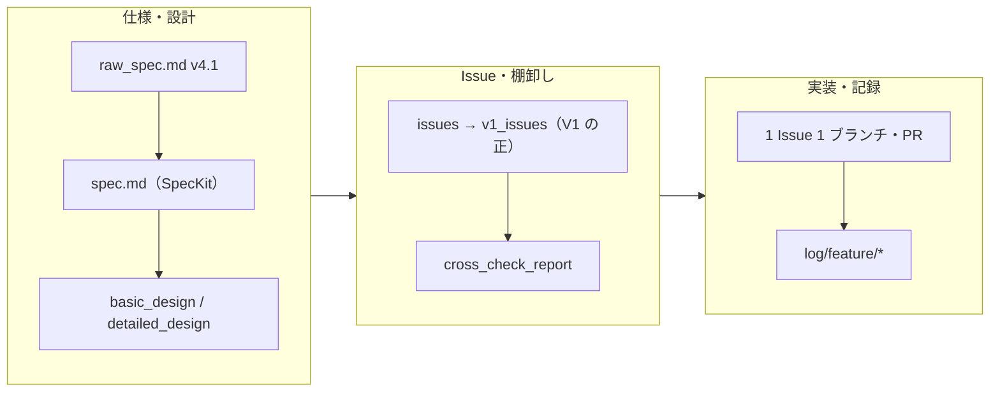

# 開発プロセス（Spec 駆動）

## V1（MVP）の定義

V1 は **「コア体験が成立するかを検証する最小構成」** として定義した。具体的には **曲選択 → 歌唱 → 記録 → 振り返り** のフローが一連で動作することを完了条件とする。

| 判断基準 | V1（今回のスコープ） | V2（次期スコープ） |
|----------|---------------------|-----------------|
| コア体験に必須か | 必須 — 手動曲入力・Intent・スコア・履歴・インサイト | 付加価値 — Spotify 連携・検索 API・オンボーディング |
| 体験が完結するか | ローカルだけで完結（オフラインでも動作） | 外部 API が前提の機能 |
| 本質か付加価値か | 記録と振り返りの本質 | 体験の質を高める拡張 |

**V1 の完了条件・チェックリスト**: [`v1_issues.md`](v1_issues.md)（末尾の V1 完了判定チェックリスト）を参照。

---

## Spec → Issue → 実装 の流れ

本プロジェクトでは **SpecKit** によるスペック駆動開発を採用し、以下のフローで開発を進めた。

### 各ステップの詳細

1. **要求仕様書** — `docs/raw_spec.md`（v4.1 系）に課題・機能要求・制約（Spotify 規約など）を記述
2. **SpecKit で Feature Specification（spec.md）を生成** — User Story / Acceptance Scenario / Functional Requirements を定義
3. **基本設計書・詳細設計書を作成** — 画面遷移図・シーケンス図・クラス図・ER 図を Mermaid で記述
4. **Issue 設計で実装タスクに分解** — Phase 0（基盤）→ Phase 1（MVP）→ Phase 2（インサイト）→ Phase 3/4（Spotify 連携・品質）
5. **ドキュメント棚卸し** — `docs/cross_check_report.md` で spec・設計書・issues の整合性を確認
6. **実装** — 1 Issue 1 feature ブランチで作業し、Pull Request 経由で squash merge
7. **実装ログ** — `log/feature/i-xxx-*/` に、Issue 単位の実装メモ・判断の記録を残す

---

## AI × 仕様駆動開発

### 開発環境・ツール

| 区分 | 使用ツール |
|------|------------|
| OS / 実行 | macOS、**Xcode**（ビルド・シミュレータ・実機・デバッグ） |
| エディタ | **Cursor**（ソースの主編集）。コードの生成・修正・リファクタリングは原則すべて Cursor で実施。**GitHub Copilot によるエディタ上のコード補完・インライン生成は使用していない** |
| 仕様駆動 | **SpecKit** による `raw_spec` → `spec.md` → 設計書 → Issue 分解。実装作業は Cursor 上で行い、`.cursorrules` と `.specify/memory/constitution.md` をプロジェクトルールとして利用 |
| AI 支援（PR） | **GitHub Copilot Pro**（学生向け特典で利用）。GitHub 上の Pull Request に対するコードレビューのみに使用 |

### AI の具体的な効果

`.cursorrules`（132 行）で SwiftUI/SwiftData のコーディングルール・命名規則・Git ルールを定義し、Cursor のプロジェクトルールとして読み込ませた。`.specify/memory/constitution.md` を最上位ルールとしてプロンプトに含め、AI の出力に一貫した制約を与えている。

constitution.md に「Spotify メタデータは永続化禁止」「`spotifyTrackId` のみ保持可」の制約を明記した結果、AI が Track モデルを生成する際に `userEnteredName`（ユーザー生成データ＝永続化可）と Spotify 由来データの区別を自発的に判別し、convenience init の分離やコメントでの理由記載まで一貫して行った。人間のレビューは「制約に違反していないか」の確認に集中でき、生成コードの修正量が大幅に削減された。

---

## Spec / Issue / 実装の対応関係

Phase 0〜2（V1 スコープ）は全 Issue 実装済み。代表的なものを抜粋:

| Issue | 概要 | 実装の要点 | テスト |
|-------|------|-----------|--------|
| I-002 | SwiftData モデル定義 | `Track`（メタデータ非永続化・dual init）、`SingingSession`（UUID idempotency key） | — |
| I-003 | SessionRepository | 保存（冪等）・更新（Track 差し替え禁止）・削除（singCount 減算）・fetchByIntent | 4 ファイル |
| I-009/011 | 歌唱記録 + 冪等性 | RecordingSheetViewModel + exists(uuid) チェック | `I011SessionIdempotencyTests` |
| I-014/015 | History + Infinite Scroll | 値型スナップショット・loadGeneration・20 件ページング | 3 ファイル |
| I-017/018 | インテントタブ + タイムマシン | IntentTabViewModel・月次ランキング集計 | `IntentTabViewModelTests` |

全対応は [`v1_issues.md`](v1_issues.md) を参照。
