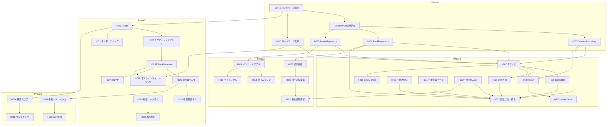

# ヒトカラモバイルiOS - Issue設計（開発タスク）

**Version**: 1.1  
**Created**: 2026-03-12  
**Updated**: 2026-03-12（Spotify API規約準拠、メタデータ非永続化、クロスチェック反映）  
**参照**: docs/basic_design.md, docs/detailed_design.md, specs/001-hitora-karaoke-ios/spec.md, docs/raw_spec.md v4.1

---

## 1. 開発期間・フェーズの定義

### フェーズ概要

| フェーズ | 名称 | 目標 | 想定期間 |
|----------|------|------|----------|
| **Phase 0** | 基盤構築 | プロジェクトセットアップ、データモデル、Repository | 1-2週間 |
| **Phase 1** | MVP | 歌唱記録・履歴閲覧・オフライン対応の最小機能 | 2-3週間 |
| **Phase 2** | インサイト・検索 | タイムマシン、マイアンセム、ハイブリッド検索 | 2週間 |
| **Phase 3** | Spotify連携 | OAuth、メタデータ表示、視聴履歴、検索API、エラー処理 | 2週間 |
| **Phase 4** | 機能拡張・品質 | 手動リフレッシュ、アクセシビリティ、ログ、テスト | 1-2週間 |

### MVP の定義

- 歌唱セッションの記録（Intent、スコア、メモ）
- 履歴一覧（日時順、Intentフィルター、Infinite Scroll）
- オフラインでのローカル保存
- 手動曲名入力（オフライン時は接続案内）

※ Spotify連携なしでも、手動入力で記録・履歴閲覧が可能な状態。Phase 1 の履歴表示は `userEnteredName` のみ（Spotify Track ID の曲は Phase 3 以降）。

---

## 2. Issue一覧

### Phase 0: 基盤構築

| ID | タイトル | 優先度 | 概要 |
|----|----------|--------|------|
| I-001 | プロジェクト初期化 | Must | Xcodeプロジェクト作成、iOS 17+、Swift 5.9、SwiftUI |
| I-002 | SwiftDataモデル定義 | Must | Track, SingingSession の @Model 定義。Track は spotifyTrackId, userEnteredName のみ。曲名・アートワーク等は永続化しない（Spotify API規約） |
| I-003 | SessionRepository 実装 | Must | save, fetchAll, fetchByIntent, exists（UUID） |
| I-004 | TrackRepository 実装 | Must | searchLocal(query), getOrCreate(spotifyTrackId?, userEnteredName?), incrementSingCount |
| I-005 | InsightRepository 実装 | Must | getTimeMachineRanking, getMyAnthemRanking |
| I-006 | ネットワーク監視ユーティリティ | Must | NWPathMonitor による接続状態の検知 |

### Phase 1: MVP

| ID | タイトル | 優先度 | 概要 |
|----|----------|--------|------|
| I-007 | タブナビゲーション基盤 | Must | 選曲画面（2タブ）、History、設定への遷移 |
| I-008 | Intent選択画面 | Must | Shout/Emo/Practice の3択UI |
| I-009 | 歌唱記録入力画面 | Must | スコア（0-100）、メモ入力、保存ボタン |
| I-010 | 二重送信防止（UI層） | Must | 保存ボタン非活性化、ProgressView、ブロック |
| I-011 | 二重送信防止（データ層） | Must | UUID存在チェック、冪等性 |
| I-012 | 手動曲名入力画面 | Must | 曲名入力、オフライン時は接続案内＋導線 |
| I-013 | 歌唱記録フロー統合 | Must | 曲選択→Intent→入力→保存の一連フロー |
| I-014 | History画面 | Must | 日時順一覧、Intentフィルター。Phase 1 では userEnteredName で曲名表示 |
| I-015 | Infinite Scroll | Must | ページネーション、大量データ対応 |
| I-016 | Empty State（歌唱0件） | Must | 「まず1曲歌ってみよう！」導線 |

### Phase 2: インサイト・検索

| ID | タイトル | 優先度 | 概要 |
|----|----------|--------|------|
| I-017 | インテントタブUI | Must | タイムマシン・マイアンセムの表示領域 |
| I-018 | タイムマシン表示 | Must | 過去1ヶ月ランキング、ローカルDBから取得。Phase 2 では userEnteredName で曲名表示 |
| I-019 | マイアンセム表示 | Must | Intent別の回数・点数ランキング |
| I-020 | 検索画面 | Must | 検索欄、結果リスト、ローカル優先表示、**Spotify クレジット（Powered by Spotify 等）の配置** |
| I-021 | ローカル検索（インクリメンタル） | Must | userEnteredName に対する SwiftData 検索、歌った回数順 |
| I-022 | 検索結果0件時の「手動で追加」 | Must | キーワード引き継ぎ、手動入力への導線 |

### Phase 3: Spotify連携

| ID | タイトル | 優先度 | 概要 |
|----|----------|--------|------|
| I-023 | OAuth 2.0 PKCE 実装 | Must | 認証フロー、Keychainにトークン保存 |
| I-024 | トークンリフレッシュ | Must | 期限切れ時の自動更新、失敗時は再ログイン案内 |
| I-024A | TrackMetadataService / TrackMetadataCache 実装 | Must | actor ベースの24時間インメモリキャッシュ、Track ID から API 取得。メタデータ永続化禁止（Spotify API規約） |
| I-025 | 最近再生した曲API | Must | GET /me/player/recently-played。**24時間以内の一時キャッシュのみ**（永続化禁止） |
| I-026 | Spotify視聴履歴タブ | Should | TrackMetadataCache 経由でメタデータ表示、Empty時は手動入力ボタン |
| I-027 | 検索API（Debounce 0.5秒） | Must | GET /search?q=...&type=track、ローカル結果の下部に追加。検索結果のメタデータはキャッシュに載せる |
| I-028 | オフライン時のフォールバック | Must | ネットワーク未接続時の TrackMetadataCache からのローカルキャッシュ表示 |
| I-029 | 指数バックオフ・リトライ | Must | 429/5xx 時の指数バックオフ、Jitter |
| I-030 | APIエラー時の再試行UI | Must | エラーメッセージ、再試行ボタン |
| I-031 | オンボーディング画面 | Should | 初回起動時のSpotify連携案内（スキップ可） |

### Phase 4: 機能拡張・品質

| ID | タイトル | 優先度 | 概要 |
|----|----------|--------|------|
| I-032 | 手動リフレッシュ | Must | プルダウン or 設定画面のリフレッシュボタン |
| I-033 | 設定画面 | Should | Spotify連携状態、リフレッシュ、ネットワーク導線、**Spotify クレジット（Powered by Spotify 等）**、**プライバシーポリシー（Web）へのリンク** |
| I-034 | JSON構造化ログ | Should | 全API通信でtimestamp, request_id, endpoint, latency_ms等 |
| I-035 | PIIマスキング | Must | user_idのSHA-256ハッシュ化、トークン非記録 |
| I-036 | VoiceOver対応 | Could | 主要画面のアクセシビリティラベル |
| I-037 | Dynamic Type対応 | Could | フォントスケーリング |
| I-038 | 単体テスト（Repository） | Should | SessionRepository, TrackRepository のテスト |
| I-039 | UIテスト（主要フロー） | Could | 歌唱記録、履歴閲覧のE2Eテスト |

---

## 3. タスク詳細（Why・ベストプラクティス）

実装・アーキテクチャに関わるタスクについて、採用理由とベストプラクティスを明記する。

### 3.1 Phase 0

#### I-002 SwiftDataモデル定義

**Why メタデータ永続化禁止（Track）**  
Spotify API の利用規約により、曲名・アーティスト名・アートワーク等のメタデータの永続保存が禁止されている。そのため、Track には `spotifyTrackId` と `userEnteredName`（手動入力曲用、ユーザー生成データのため永続化可）のみを保持する。表示用メタデータは API または 24 時間以内の一時キャッシュから取得する。

**Why SwiftData**  
iOS 17+ のネイティブ ORM。SwiftUI との統合が良く、オフラインファーストの永続化層として最適。Core Data の後継として @Model によるスキーマ定義が簡潔。

---

#### I-004 TrackRepository 実装

**Why searchLocal**  
ローカル DB の検索であることを明示。Spotify API 検索は別サービス（SpotifySearchService）で行う。混同を避けるため `search` ではなく `searchLocal` とする。

**Why getOrCreate(spotifyTrackId?, userEnteredName?)**  
- オンライン時: Spotify から Track ID を取得し、`spotifyTrackId` で Track を検索または作成。  
- オフライン時: ユーザーが手動入力した曲名を `userEnteredName` として保存。同一曲の 2 回目以降は既存 Track を取得し、SingingSession のみ追加する。

---

### 3.2 Phase 2

#### I-021 ローカル検索（インクリメンタル）

**Why userEnteredName 検索**  
Spotify メタデータは永続化しないため、ローカル検索の対象は `userEnteredName` のみ。Spotify Track ID のみの曲（Phase 3 以降に登場）は曲名で検索できないが、TrackMetadataCache にヒットすれば表示可能。Phase 2 時点では Spotify 連携は未実装のため、すべて userEnteredName ベースで問題ない。

---

### 3.3 Phase 3

#### I-024A TrackMetadataService / TrackMetadataCache 実装

**Why actor ベースの 24 時間インメモリキャッシュ**  
- **actor**: Swift の並行安全性を保証。複数スレッドからアクセスされてもデータ競合を防ぐ。  
- **24 時間**: Spotify API 規約で許容される一時キャッシュの上限。永続化しないことで規約準拠。  
- **インメモリ**: 永続化しないため、アプリ終了時には消える。再起動時は API から再取得する。

**Why NSCache ではなく actor**  
NSCache はメモリ圧迫時に自動エビクトするが、有効期限（24 時間）の制御が難しい。actor で独自に `maxAge` と `maxCount` を管理し、規約準拠とキャッシュヒット率のバランスを取る。

**Why TrackMetadataService**  
Track ID からメタデータを取得する責務を集約。API 呼び出し（GET /v1/tracks/{id}）とキャッシュの透過的な利用を実現。検索 API や recently-played API のレスポンスで取得したメタデータもキャッシュに載せ、再利用する。

---

#### I-025 最近再生した曲API

**Why 24 時間以内の一時キャッシュで永続化禁止**  
Spotify API 規約により、メタデータの永続保存が禁止されている。UserDefaults への永続保存は規約違反の可能性がある。24 時間以内のインメモリ一時キャッシュのみを使用する。アプリ起動時・手動リフレッシュで API から再取得し、キャッシュを上書きする。

---

#### I-028 オフライン時のフォールバック

**Why TrackMetadataCache からのフォールバック**  
Track には Track ID のみ保存されているため、オフライン時はメタデータを表示できない。TrackMetadataCache に 24 時間以内に取得したメタデータが残っていれば、キャッシュから表示する。キャッシュにない場合は「曲情報を取得できません（ネットワーク接続が必要）」等と表示する（spec の Edge Cases に準拠）。

---

### 3.4 Phase 4

#### I-033 設定画面

**Why Spotify クレジット**  
App Store 審査の前提。Spotify のブランドガイドラインに従い、検索結果画面（I-020）と設定画面の両方に「Powered by Spotify」等のクレジットを配置する（FR-018）。

**Why プライバシーポリシーリンク**  
アプリ内に「データはすべて端末内にのみ保存され、外部送信されない」旨を明記したプライバシーポリシー（Web ページ）へのリンクを設置する（FR-019）。設定画面への配置が一般的。

---

## 4. 依存関係の整理

### 4.1 ブロック関係図



### 4.2 着手順序（推奨）

```text
Phase 0（並列可能）:
  I-001 → I-002 → I-003, I-004, I-005（並列）
  I-001 → I-006

Phase 1:
  I-007 → I-008, I-009, I-010, I-011（並列可能）
  I-012（I-007と並列可能）
  I-013（I-008, I-009, I-010, I-011, I-012 完了後）
  I-014 → I-015
  I-016（I-007 完了後）

Phase 2:
  I-017 → I-018, I-019（並列可能）
  I-020 → I-021 → I-022

Phase 3:
  I-023 → I-024 → I-024A → I-025, I-027（並列可能）
  I-024A → I-028
  I-025 → I-026
  I-006, I-028 → I-029 → I-030
  I-023 → I-031

Phase 4:
  I-032, I-033（並列可能）
  I-034 → I-035
```

### 4.3 循環依存の確認

- **I-003 と I-004**: 両方とも I-002 に依存。相互依存なし。✓
- **I-013**: I-003, I-004, I-008, I-009, I-010, I-011, I-012 に依存。これらは I-013 に依存しない。✓
- **I-026**: I-025 に依存。I-025 は I-026 に依存しない。✓
- **I-024A**: I-024 に依存。I-025, I-027, I-028 が I-024A に依存。循環なし。✓
- 循環依存なし。

---

## 5. 優先順位の決定（MoSCoW）

### Must（必須）

- I-001 〜 I-016（基盤・MVP）
- I-017 〜 I-022（インサイト・検索）
- I-023 〜 I-025, I-024A, I-027 〜 I-030（Spotify連携・メタデータ・エラー処理）
- I-032, I-035（手動リフレッシュ、PIIマスキング）

### Should（あるべき）

- I-026（Spotify視聴履歴タブ）
- I-031（オンボーディング）
- I-033（設定画面）
- I-034（構造化ログ）
- I-038（単体テスト）

### Could（あるとよい）

- I-036（VoiceOver）
- I-037（Dynamic Type）
- I-039（UIテスト）

### Won't（今回はしない）

- 録音機能
- データエクスポート
- iCloud同期
- 複数デバイス同期
- iPad対応
